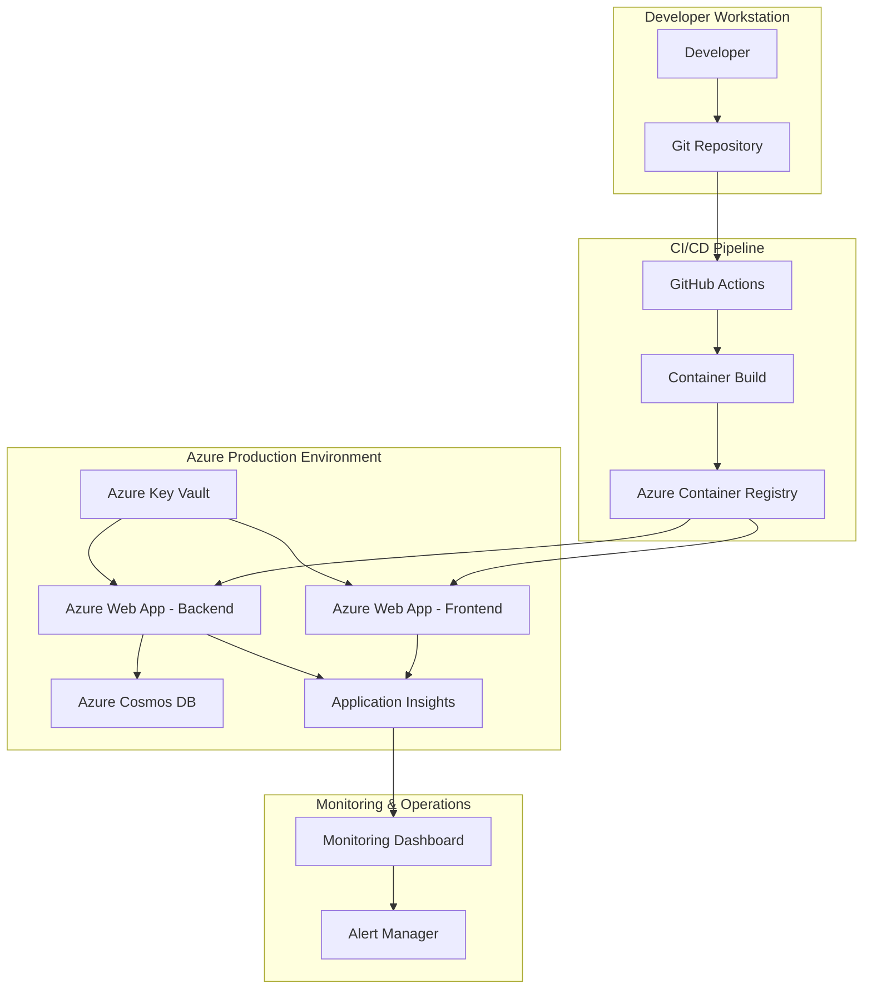

# Analysis Document 001: Bookmarks Platform Infrastructure Requirements

**Document ID**: analysis001.analysis.md
**Created**: October 25, 2025
**Analysis Lead**: Platform Engineering Business Analyst
**Phase**: Analysis
**Status**: Requirements Analysis Complete
**References**: [discovery001.discovery.md](../discovery/discovery001.discovery.md)

---

## Executive Summary

This analysis document provides detailed functional and non-functional requirements for implementing production-ready infrastructure for the Bookmarks application. Based on discovery findings, stakeholder interviews, and current system assessment, this analysis defines comprehensive requirements, constraints, and design inputs for the platform engineering initiative.

---

## 1. Requirements Gathering

### 1.1 Functional Requirements

#### FR-001: Infrastructure as Code Management
**Priority**: P0 (Must Have)
**Source**: Platform Engineers, DevOps Engineers
**Description**: Complete infrastructure provisioning and management through Terraform modules

**Detailed Requirements**:
- **FR-001.1**: Terraform modules for Azure Web Apps deployment pattern
- **FR-001.2**: Parameterized infrastructure for multiple environments (dev, staging, prod)
- **FR-001.3**: Resource group management with consistent naming conventions
- **FR-001.4**: Azure Container Registry provisioning and configuration
- **FR-001.5**: Cosmos DB provisioning with serverless configuration
- **FR-001.6**: Application Insights integration for monitoring

**Acceptance Criteria**:
- [ ] Complete infrastructure can be provisioned from scratch using `terraform apply`
- [ ] Infrastructure can be destroyed and recreated without data loss (excluding database)
- [ ] Module supports multiple environments with parameter variations
- [ ] All resources follow enterprise naming conventions
- [ ] Terraform state is managed remotely (Azure Storage)

**User Workflows**:
1. Platform engineer runs `terraform init` and `terraform apply`
2. Infrastructure provisions automatically with all dependencies
3. Outputs provide connection strings and endpoints for applications
4. Changes to infrastructure are version-controlled and reviewable

#### FR-002: Automated Container Deployment
**Priority**: P0 (Must Have)
**Source**: Frontend Developers, Backend Developers
**Description**: Automated build and deployment of containerized applications

**Detailed Requirements**:
- **FR-002.1**: GitHub Actions CI/CD pipeline for frontend React application
- **FR-002.2**: GitHub Actions CI/CD pipeline for backend FastAPI application
- **FR-002.3**: Multi-stage Docker builds for optimized container images
- **FR-002.4**: Container registry push and Azure Web Apps deployment
- **FR-002.5**: Environment-specific container deployment (dev/staging/prod)
- **FR-002.6**: Rollback capability for failed deployments

**Acceptance Criteria**:
- [ ] Code push to main branch triggers automated build and deployment
- [ ] Frontend container deploys to Azure Web App with production optimizations
- [ ] Backend container deploys to Azure Web App with proper health checks
- [ ] Deployment process completes within 10 minutes
- [ ] Failed deployments can be rolled back within 5 minutes
- [ ] Container images are scanned for security vulnerabilities

**User Workflows**:
1. Developer pushes code to repository
2. GitHub Actions triggers build pipeline
3. Containers are built, tested, and pushed to ACR
4. Azure Web Apps pull new container images
5. Health checks validate successful deployment
6. Rollback initiated if health checks fail

#### FR-003: Environment Configuration Management
**Priority**: P0 (Must Have)
**Source**: DevOps Engineers, Security Engineers
**Description**: Secure and automated management of application configuration

**Detailed Requirements**:
- **FR-003.1**: Azure Key Vault integration for sensitive configuration
- **FR-003.2**: Environment-specific configuration injection
- **FR-003.3**: Cosmos DB connection string management
- **FR-003.4**: CORS configuration for frontend-backend communication
- **FR-003.5**: Application Insights instrumentation key management
- **FR-003.6**: Debug and logging level configuration per environment

**Acceptance Criteria**:
- [ ] All sensitive values (DB keys, secrets) stored in Azure Key Vault
- [ ] Web Apps access secrets via managed identity (no hardcoded credentials)
- [ ] Environment variables are automatically injected during deployment
- [ ] Configuration changes can be applied without redeployment
- [ ] Audit trail exists for all configuration changes

**User Workflows**:
1. DevOps engineer updates configuration in Azure Key Vault
2. Web Apps automatically retrieve updated configuration via managed identity
3. Applications restart if required configuration changes
4. Audit logs capture all configuration access and changes

#### FR-004: Application Monitoring and Observability
**Priority**: P1 (Should Have)
**Source**: Site Reliability Engineers, Support Engineers
**Description**: Comprehensive monitoring, logging, and alerting for production applications

**Detailed Requirements**:
- **FR-004.1**: Application Insights integration for both frontend and backend
- **FR-004.2**: Custom metrics for bookmark operations (CRUD operations)
- **FR-004.3**: Error tracking and exception reporting
- **FR-004.4**: Performance monitoring and response time tracking
- **FR-004.5**: Log aggregation and structured logging
- **FR-004.6**: Alerting for critical failures and performance degradation

**Acceptance Criteria**:
- [ ] All HTTP requests are tracked with response times
- [ ] Application errors are captured and categorized
- [ ] Custom business metrics are collected and displayed
- [ ] Alerts are configured for 5xx errors and high response times
- [ ] Log retention follows enterprise data governance policies

**User Workflows**:
1. SRE monitors application health via Application Insights dashboard
2. Alerts notify team of performance issues or failures
3. Support engineer uses logs to troubleshoot user issues
4. Metrics inform capacity planning decisions

#### FR-005: Health Check and Readiness Probes
**Priority**: P0 (Must Have)
**Source**: Platform Engineers, DevOps Engineers
**Description**: Health check endpoints for Azure Web Apps and load balancer integration

**Detailed Requirements**:
- **FR-005.1**: Backend health check endpoint (`/health`) validates all dependencies
- **FR-005.2**: Frontend health check validates static asset availability
- **FR-005.3**: Cosmos DB connectivity validation in health checks
- **FR-005.4**: Graceful degradation when non-critical services unavailable
- **FR-005.5**: Health check integration with Azure Web Apps health monitoring

**Acceptance Criteria**:
- [ ] Health endpoints return 200 OK when all systems operational
- [ ] Health endpoints return 503 Service Unavailable when critical dependencies fail
- [ ] Health checks complete within 2 seconds
- [ ] Azure Web Apps automatically restart unhealthy containers
- [ ] Health check status is exposed in monitoring dashboards

### 1.2 Non-Functional Requirements

#### NFR-001: Performance Requirements
**Priority**: P0 (Must Have)
**Source**: End Users, Business Stakeholders

**Detailed Requirements**:
- **NFR-001.1**: Frontend page load time < 3 seconds (initial load)
- **NFR-001.2**: API response time < 500ms for CRUD operations (95th percentile)
- **NFR-001.3**: Application startup time < 60 seconds
- **NFR-001.4**: Support for 100 concurrent users (dev), 1000 concurrent users (prod)
- **NFR-001.5**: Database query response time < 200ms (95th percentile)

**Measurement Criteria**:
- Application Insights performance monitoring
- Load testing with Azure Load Testing
- Database performance metrics from Cosmos DB
- User experience monitoring via Real User Monitoring (RUM)

#### NFR-002: Security Requirements
**Priority**: P0 (Must Have)
**Source**: Security Engineers, Compliance Team

**Detailed Requirements**:
- **NFR-002.1**: All data in transit encrypted using TLS 1.2 or higher
- **NFR-002.2**: All data at rest encrypted using Azure default encryption
- **NFR-002.3**: Managed identity authentication for all Azure service connections
- **NFR-002.4**: Container image vulnerability scanning with critical CVE blocking
- **NFR-002.5**: Secrets rotation capability with zero downtime
- **NFR-002.6**: Network security groups and private endpoints where applicable

**Compliance Requirements**:
- SOC 2 Type II compliance for data handling
- GDPR compliance for user data (if applicable)
- Enterprise security policy adherence
- Regular security scanning and penetration testing

#### NFR-003: Reliability Requirements
**Priority**: P0 (Must Have)
**Source**: Business Stakeholders, End Users

**Detailed Requirements**:
- **NFR-003.1**: Application uptime 99.9% (allowing 43.2 minutes downtime/month)
- **NFR-003.2**: Recovery Time Objective (RTO) < 15 minutes for system failures
- **NFR-003.3**: Recovery Point Objective (RPO) < 1 hour for data loss scenarios
- **NFR-003.4**: Automatic failover for Web Apps across availability zones
- **NFR-003.5**: Database backup and point-in-time restore capability

**Disaster Recovery**:
- Azure Web Apps auto-scaling and health monitoring
- Cosmos DB automatic failover and backup
- Infrastructure as Code for rapid environment recreation
- Documented runbooks for incident response

#### NFR-004: Scalability Requirements
**Priority**: P1 (Should Have)
**Source**: Platform Engineers, Business Stakeholders

**Detailed Requirements**:
- **NFR-004.1**: Horizontal scaling from 1 to 10 instances based on CPU/memory
- **NFR-004.2**: Auto-scaling rules configured for peak usage patterns
- **NFR-004.3**: Database scaling via Cosmos DB serverless model
- **NFR-004.4**: CDN integration for static asset delivery (future enhancement)
- **NFR-004.5**: Load testing validation for scaling thresholds

#### NFR-005: Maintainability Requirements
**Priority**: P1 (Should Have)
**Source**: DevOps Engineers, Platform Engineers

**Detailed Requirements**:
- **NFR-005.1**: Infrastructure changes deployable within 10 minutes
- **NFR-005.2**: Application deployment with zero-downtime rolling updates
- **NFR-005.3**: Comprehensive logging for troubleshooting and debugging
- **NFR-005.4**: Automated testing for infrastructure changes
- **NFR-005.5**: Documentation automation and self-documenting code

---

## 2. Constraint Analysis

### 2.1 Technical Constraints

#### TC-001: Azure Cloud Platform Constraint
**Type**: Infrastructure
**Impact**: High
**Description**: All infrastructure must use Azure services to maintain consistency with enterprise architecture

**Implications**:
- Service selection limited to Azure offerings
- Integration patterns must follow Azure best practices
- Cost optimization focused on Azure-specific features
- Skills development focused on Azure expertise

**Mitigation Strategies**:
- Leverage Azure Well-Architected Framework
- Use Azure-native services for maximum integration
- Implement Azure Cost Management monitoring
- Provide Azure-specific training for team

#### TC-002: Container-Based Deployment Constraint
**Type**: Deployment Model
**Impact**: Medium
**Description**: Applications must be containerized using Docker for consistency and portability

**Implications**:
- All applications must have Dockerfile configurations
- Container images must be optimized for production
- Container registry required for image management
- Health checks must be container-aware

**Current State Assessment**:
- ✅ Frontend Dockerfile.frontend exists and functional
- ✅ Backend Dockerfile.backend exists and functional
- ✅ Docker Compose configuration for local development
- ❌ Production-optimized container configurations needed

#### TC-003: Existing Cosmos DB Integration Constraint
**Type**: Database/Integration
**Impact**: Medium
**Description**: Must maintain compatibility with existing Cosmos DB schema and API patterns

**Current Implementation Analysis**:
```python
# Existing configuration from config.py
cosmos_endpoint: str = os.getenv("COSMOS_ENDPOINT", "")
cosmos_key: str = os.getenv("COSMOS_KEY", "")
cosmos_database_name: str = os.getenv("COSMOS_DATABASE_NAME", "bookmarks_db")
cosmos_container_name: str = os.getenv("COSMOS_CONTAINER_NAME", "bookmarks")
```

**Constraints**:
- Database name: `bookmarks_db`
- Container name: `bookmarks`
- Authentication via connection string and key
- SQL API interface required

#### TC-004: React/Vite Build System Constraint
**Type**: Frontend Build
**Impact**: Low
**Description**: Frontend uses Vite build system which requires specific optimization for production

**Current Configuration**:
- Vite 4.3.0 build system
- React 18.2.0 framework
- Tailwind CSS for styling
- Environment variable injection via `VITE_` prefix

**Build Requirements**:
- Production build optimization
- Environment-specific configuration injection
- Static asset optimization and caching
- Bundle size optimization

### 2.2 Business Constraints

#### BC-001: Timeline Constraint
**Type**: Project Timeline
**Impact**: High
**Description**: Q4 2025 delivery requirement with 2-3 engineer capacity

**Timeline Breakdown**:
- Week 1-2: Infrastructure development and testing
- Week 3-4: CI/CD pipeline implementation
- Week 5-6: Monitoring and security implementation
- Week 7-8: Testing, documentation, and handoff

**Resource Allocation**:
- 1 Senior Platform Engineer (Terraform, Azure)
- 1 DevOps Engineer (CI/CD, automation)
- 1 Frontend/Backend Developer (application optimization)

#### BC-002: Budget Constraint
**Type**: Operational Cost
**Impact**: Medium
**Description**: Target monthly infrastructure cost < $100 for development, < $500 for production

**Cost Optimization Strategies**:
- Azure Web Apps B1/S1 SKU for development
- Cosmos DB serverless billing model
- Basic SKU for Container Registry
- Application Insights with data retention limits
- Auto-scaling rules to minimize idle resource costs

#### BC-003: Skills Development Constraint
**Type**: Team Capability
**Impact**: Medium
**Description**: Team has varying levels of Terraform and Azure expertise

**Skills Assessment**:
- Terraform: Intermediate (some team members)
- Azure Web Apps: Beginner
- Azure Container Registry: Beginner
- GitHub Actions: Intermediate
- Azure Key Vault: Beginner

**Training Requirements**:
- Terraform best practices workshop (8 hours)
- Azure PaaS services overview (4 hours)
- Security and compliance training (4 hours)

### 2.3 Regulatory and Compliance Constraints

#### RC-001: Data Protection Requirements
**Type**: Compliance
**Impact**: Medium
**Description**: User data must be protected according to enterprise data governance policies

**Requirements**:
- Data encryption at rest and in transit
- Audit logging for all data access
- Data retention and deletion policies
- User consent and privacy controls

#### RC-002: Security Standards Compliance
**Type**: Security
**Impact**: High
**Description**: Infrastructure must meet enterprise security standards

**Requirements**:
- Multi-factor authentication for administrative access
- Network security groups and firewall rules
- Vulnerability scanning for all deployed components
- Security incident response procedures

---

## 3. Stakeholder Requirements Validation

### 3.1 User Acceptance Criteria by Stakeholder

#### Frontend Developers
**Primary Requirements**:
- ✅ Automated build and deployment on code push
- ✅ Production environment testing capability
- ✅ Error tracking and monitoring integration
- ✅ Performance monitoring for frontend assets

**Success Metrics**:
- Deployment time: < 10 minutes
- Build success rate: > 95%
- Mean time to feedback: < 5 minutes

#### Backend Developers
**Primary Requirements**:
- ✅ Database connectivity in all environments
- ✅ API monitoring and performance tracking
- ✅ Automated testing integration
- ✅ Log aggregation and searchability

**Success Metrics**:
- API response time: < 500ms (95th percentile)
- Error rate: < 1%
- Deployment reliability: > 99%

#### Platform Engineers
**Primary Requirements**:
- ✅ Reusable Terraform modules
- ✅ Standardized naming conventions
- ✅ Infrastructure documentation and examples
- ✅ Cost monitoring and optimization

**Success Metrics**:
- Infrastructure provisioning time: < 30 minutes
- Module reusability: 100% for new projects
- Cost variance: < 10% from budget

#### DevOps Engineers
**Primary Requirements**:
- ✅ Automated CI/CD pipelines
- ✅ Secrets management integration
- ✅ Monitoring and alerting setup
- ✅ Incident response procedures

**Success Metrics**:
- Pipeline reliability: > 95%
- Mean time to recovery: < 15 minutes
- Alert false positive rate: < 5%

### 3.2 Priority Matrix Validation

| Requirement | Frontend Dev | Backend Dev | Platform Eng | DevOps Eng | Business Value | Final Priority |
|-------------|-------------|-------------|-------------|------------|----------------|----------------|
| Infrastructure as Code | Medium | Medium | High | High | High | P0 |
| Automated Deployment | High | High | Medium | High | High | P0 |
| Monitoring & Alerting | Medium | High | Medium | High | High | P1 |
| Security Hardening | Low | Medium | Medium | High | Medium | P1 |
| Auto-scaling | Low | Low | Medium | Medium | Medium | P2 |
| Cost Optimization | Low | Low | High | Medium | High | P1 |

### 3.3 Trade-off Analysis

#### Performance vs. Cost
**Trade-off**: Higher performance requires premium Azure SKUs increasing operational costs
**Decision**: Use auto-scaling with B1/S1 SKUs and scale up only when needed
**Rationale**: Balances performance needs with budget constraints

#### Security vs. Complexity
**Trade-off**: Enhanced security measures increase implementation complexity
**Decision**: Implement managed identity and Key Vault integration despite complexity
**Rationale**: Security requirements are non-negotiable for enterprise deployment

#### Feature Completeness vs. Timeline
**Trade-off**: Advanced features (auto-scaling, CDN) may impact delivery timeline
**Decision**: Implement core features first, advanced features in subsequent iterations
**Rationale**: Delivery timeline is critical; advanced features can be added later

---

## 4. Gap Analysis

### 4.1 Current vs Future State Analysis

#### Infrastructure Gap Analysis

| Component | Current State | Desired Future State | Gap | Priority |
|-----------|---------------|---------------------|-----|----------|
| **Infrastructure** | Manual setup | Terraform IaC | Complete automation needed | P0 |
| **Deployment** | Local only | Multi-environment CI/CD | Production deployment pipeline | P0 |
| **Monitoring** | None | Application Insights + alerts | Complete monitoring solution | P1 |
| **Security** | Basic | Enterprise-grade | Managed identity, Key Vault | P1 |
| **Scaling** | Manual | Auto-scaling | Scaling policies and rules | P2 |

#### Architecture Gap Analysis

**Current Architecture**:
```
Developer → Local Docker Compose → Manual Cosmos DB
```

**Target Architecture**:
```
Developer → GitHub → CI/CD → Azure Container Registry → Azure Web Apps → Cosmos DB
                                      ↓
                              Application Insights → Monitoring Dashboard
```

**Major Gaps Identified**:
1. **CI/CD Pipeline**: No automated build/deploy process
2. **Container Registry**: No centralized container image management
3. **Production Environment**: No production infrastructure
4. **Monitoring**: No observability or alerting capabilities
5. **Security**: No secrets management or identity controls

### 4.2 Capability Gap Assessment

#### Technical Capabilities

| Capability | Current Maturity | Required Maturity | Gap Size | Effort |
|------------|------------------|-------------------|-----------|---------|
| **Terraform Expertise** | Beginner | Intermediate | Medium | 2 weeks |
| **Azure PaaS Services** | Beginner | Intermediate | Medium | 1 week |
| **Container Orchestration** | Intermediate | Advanced | Small | 1 week |
| **CI/CD Pipeline Design** | Intermediate | Advanced | Small | 1 week |
| **Security Best Practices** | Beginner | Intermediate | Medium | 2 weeks |

#### Process Capabilities

| Process | Current State | Target State | Gap | Timeline |
|---------|---------------|--------------|-----|----------|
| **Infrastructure Provisioning** | Manual | Automated | Complete automation | Sprint 1 |
| **Application Deployment** | Manual | Automated | CI/CD pipeline | Sprint 2 |
| **Configuration Management** | Manual | Automated | Key Vault integration | Sprint 2 |
| **Monitoring & Alerting** | None | Automated | Complete monitoring setup | Sprint 3 |
| **Incident Response** | Ad hoc | Structured | Runbooks and procedures | Sprint 4 |

### 4.3 Technical Debt Assessment

#### Infrastructure Technical Debt

| Debt Item | Impact | Effort to Fix | Priority |
|-----------|--------|---------------|----------|
| **No Infrastructure as Code** | High | High | P0 |
| **Manual deployment processes** | High | Medium | P0 |
| **No monitoring or logging** | Medium | Low | P1 |
| **Basic security configuration** | Medium | Medium | P1 |
| **No disaster recovery plan** | Low | Medium | P2 |

#### Application Technical Debt

| Debt Item | Impact | Effort to Fix | Priority |
|-----------|--------|---------------|----------|
| **Container image optimization** | Low | Low | P2 |
| **Health check enhancements** | Medium | Low | P1 |
| **Configuration management** | Medium | Medium | P1 |
| **Error handling standardization** | Low | Low | P2 |

---

## 5. Risk Register

### 5.1 Technical Risks

| Risk ID | Risk Description | Probability | Impact | Risk Score | Mitigation Strategy |
|---------|------------------|-------------|--------|------------|-------------------|
| **TR-001** | Azure Web Apps performance insufficient for load | Low | High | Medium | Load testing during development, auto-scaling configuration |
| **TR-002** | Container image size causes slow deployments | Medium | Medium | Medium | Multi-stage builds, image optimization techniques |
| **TR-003** | Cosmos DB cost overruns with serverless model | Medium | Medium | Medium | Cost monitoring, query optimization, usage alerts |
| **TR-004** | GitHub Actions pipeline reliability issues | Low | Medium | Low | Pipeline redundancy, fallback deployment methods |
| **TR-005** | Terraform state corruption or loss | Low | High | Medium | Remote state backend, state backups, access controls |

### 5.2 Business Risks

| Risk ID | Risk Description | Probability | Impact | Risk Score | Mitigation Strategy |
|---------|------------------|-------------|--------|------------|-------------------|
| **BR-001** | Project timeline delays due to complexity | Medium | High | High | Phased delivery, MVP approach, resource flexibility |
| **BR-002** | Skills gap impacts quality and timeline | Medium | Medium | Medium | Training plan, external consulting, knowledge transfer |
| **BR-003** | Cost overruns exceed budget constraints | Low | Medium | Low | Cost monitoring, budget alerts, resource optimization |
| **BR-004** | Stakeholder alignment issues delay decisions | Low | Medium | Low | Regular stakeholder updates, clear communication plan |

### 5.3 Security Risks

| Risk ID | Risk Description | Probability | Impact | Risk Score | Mitigation Strategy |
|---------|------------------|-------------|--------|------------|-------------------|
| **SR-001** | Container vulnerabilities in production | Medium | High | High | Automated vulnerability scanning, base image updates |
| **SR-002** | Exposed secrets or credentials | Low | High | Medium | Azure Key Vault, managed identity, secret rotation |
| **SR-003** | Network security configuration errors | Low | Medium | Low | Security review, automated compliance checking |
| **SR-004** | Data breach due to misconfiguration | Low | High | Medium | Security training, compliance automation, audit logging |

### 5.4 Risk Mitigation Timeline

| Sprint | Risk Mitigation Activities |
|--------|---------------------------|
| **Sprint 1** | TR-005: Implement remote Terraform state, SR-002: Azure Key Vault setup |
| **Sprint 2** | TR-001: Load testing framework, SR-001: Container vulnerability scanning |
| **Sprint 3** | TR-003: Cost monitoring setup, BR-002: Skills assessment and training |
| **Sprint 4** | SR-003: Security configuration review, BR-001: Timeline adjustment if needed |

---

## 6. Design Inputs

### 6.1 Architecture Requirements

#### High-Level Architecture Components


#### Infrastructure Components
| Component | Service | SKU/Configuration | Purpose |
|-----------|---------|-------------------|---------|
| **Compute** | Azure Web Apps | B1 (dev), S1 (prod) | Container hosting |
| **Container Registry** | Azure Container Registry | Basic | Image storage |
| **Database** | Azure Cosmos DB | Serverless | Data persistence |
| **Monitoring** | Application Insights | Standard | Observability |
| **Security** | Azure Key Vault | Standard | Secrets management |
| **Networking** | Azure Virtual Network | Standard | Network isolation |

### 6.2 Integration Patterns

#### Service Integration Requirements
1. **Web Apps to Cosmos DB**: Managed identity authentication
2. **Web Apps to Key Vault**: Managed identity for secret retrieval
3. **Frontend to Backend**: HTTPS with CORS configuration
4. **CI/CD to Azure**: Service principal with minimal permissions
5. **Monitoring Integration**: Application Insights SDKs in both applications

#### Data Flow Requirements
1. **User Request Flow**: Frontend → Backend → Cosmos DB → Response
2. **Deployment Flow**: Git Push → GitHub Actions → ACR → Web Apps
3. **Monitoring Flow**: Applications → Application Insights → Dashboards → Alerts
4. **Configuration Flow**: Key Vault → Web Apps → Applications

### 6.3 Security Architecture Requirements

#### Identity and Access Management
- **Managed Identity**: System-assigned identities for all Web Apps
- **Service Principal**: Limited scope for CI/CD operations
- **Role-Based Access Control**: Least privilege principle
- **Key Vault Access Policies**: Granular secret access controls

#### Network Security
- **HTTPS Enforcement**: All traffic encrypted in transit
- **Network Security Groups**: Restrictive inbound/outbound rules
- **Private Endpoints**: For Key Vault and Cosmos DB (if budget allows)
- **CORS Configuration**: Restrictive cross-origin policies

### 6.4 Operational Requirements

#### Monitoring and Alerting
- **Application Performance**: Response time, throughput, error rate
- **Infrastructure Health**: CPU, memory, disk, network utilization
- **Business Metrics**: User activity, bookmark operations, feature usage
- **Cost Monitoring**: Daily spend, budget alerts, resource optimization

#### Backup and Recovery
- **Cosmos DB**: Automatic backup with point-in-time restore
- **Infrastructure**: Terraform state backup and version control
- **Application**: Container image versioning and rollback capability
- **Configuration**: Key Vault backup and disaster recovery

---

## 7. Implementation Roadmap

### 7.1 Sprint Planning Overview

#### Sprint 1: Infrastructure Foundation (Weeks 1-2)
**Goals**: Establish core infrastructure and Terraform modules
**Deliverables**:
- Terraform modules for Azure Web Apps pattern
- Azure Container Registry setup
- Basic Cosmos DB provisioning
- Development environment deployment

**Definition of Done**:
- [ ] Infrastructure can be provisioned from scratch
- [ ] All resources follow naming conventions
- [ ] Terraform state is managed remotely
- [ ] Basic monitoring is functional

#### Sprint 2: CI/CD Pipeline (Weeks 3-4)
**Goals**: Implement automated build and deployment pipelines
**Deliverables**:
- GitHub Actions workflows for frontend and backend
- Container build and push automation
- Automated deployment to Web Apps
- Basic security scanning integration

**Definition of Done**:
- [ ] Code push triggers automated deployment
- [ ] Container images are built and optimized
- [ ] Deployments complete within 10 minutes
- [ ] Basic rollback capability exists

#### Sprint 3: Monitoring and Security (Weeks 5-6)
**Goals**: Implement comprehensive monitoring and security controls
**Deliverables**:
- Application Insights integration
- Azure Key Vault secret management
- Managed identity configuration
- Alerting and dashboard setup

**Definition of Done**:
- [ ] All applications send telemetry to Application Insights
- [ ] Secrets are managed via Key Vault
- [ ] Managed identities are configured
- [ ] Alerts are configured for critical failures

#### Sprint 4: Testing and Documentation (Weeks 7-8)
**Goals**: Validate system performance and create operational documentation
**Deliverables**:
- Load testing and performance validation
- Security scanning and compliance verification
- Operational runbooks and troubleshooting guides
- Knowledge transfer and training materials

**Definition of Done**:
- [ ] System meets all performance requirements
- [ ] Security requirements are validated
- [ ] Complete documentation is available
- [ ] Team is trained on operational procedures

### 7.2 Success Criteria Validation

| Sprint | Success Criteria | Measurement Method |
|--------|------------------|-------------------|
| **Sprint 1** | Infrastructure provisioning < 30 minutes | Terraform execution time |
| **Sprint 2** | Deployment time < 10 minutes | CI/CD pipeline metrics |
| **Sprint 3** | All alerts functional, < 5% false positives | Monitoring dashboard |
| **Sprint 4** | System meets all NFRs | Load testing results |

---

## 8. Next Steps

### 8.1 Immediate Actions (Week 1)
1. **Stakeholder Approval**: Present analysis findings for approval
2. **Team Skills Assessment**: Validate Terraform and Azure expertise
3. **Environment Setup**: Prepare development Azure subscription
4. **Terraform Prototype**: Create basic infrastructure module prototype

### 8.2 Design Phase Preparation
1. **Architecture Review**: Conduct technical architecture review session
2. **Security Consultation**: Engage security team for requirement validation
3. **Cost Estimation**: Detailed cost analysis for all environments
4. **Risk Mitigation Planning**: Develop specific mitigation strategies

### 8.3 Design Phase Inputs Summary

**For Design Phase (`/design` command)**:
- Validated functional and non-functional requirements
- Detailed constraint analysis and mitigation strategies
- Stakeholder acceptance criteria and success metrics
- Technical debt assessment and prioritization
- Risk register with mitigation strategies
- Architecture component specifications
- Integration pattern requirements
- Security and compliance requirements

---

**Next Command**: `/design` - Create detailed system architecture and technical design

---

*This analysis document provides comprehensive requirements and constraints to inform the design phase of the Bookmarks platform infrastructure initiative.*
