# Design Document 001: Bookmarks Platform Infrastructure Architecture

**Document ID**: design001.design.md
**Created**: October 25, 2025
**Design Lead**: Senior Platform Architect
**Phase**: Design
**Status**: Technical Architecture Complete
**References**: [analysis001.analysis.md](../analysis/analysis001.analysis.md)

---

## Executive Summary

This design document transforms the validated requirements from the analysis phase into a comprehensive technical architecture for the Bookmarks platform infrastructure. The design follows platform engineering principles to create a self-service, scalable, and maintainable solution that reduces cognitive load while enabling developer productivity.

The architecture leverages Azure-native services with Infrastructure as Code (Terraform), containerized deployments, and comprehensive observability to meet all functional and non-functional requirements identified in the analysis phase.

---

## 1. Architecture Design

### 1.1 System Architecture

#### System Context Diagram
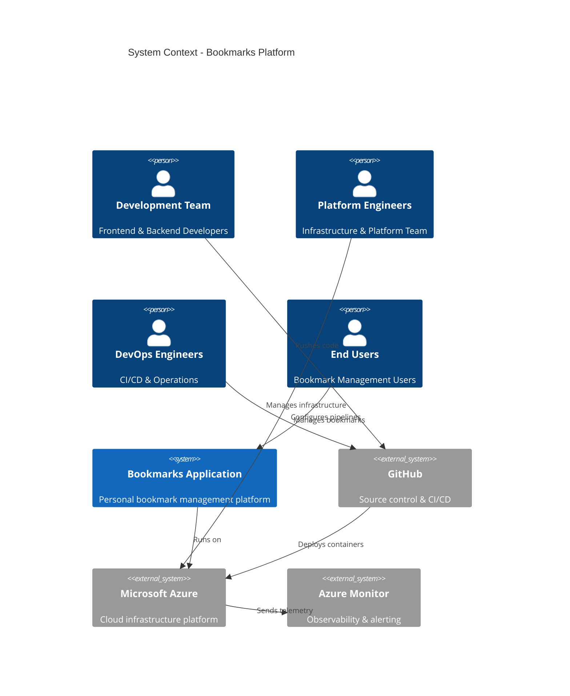

#### High-Level Architecture Components
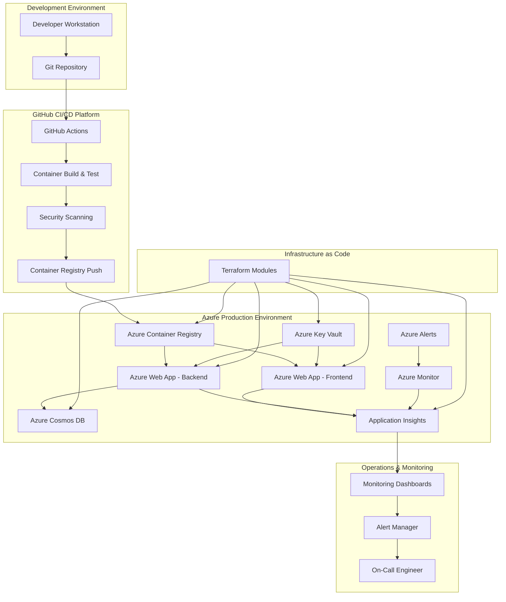

### 1.2 Component Architecture

#### Container Deployment Topology
```mermaid
graph LR
    subgraph "Azure Resource Group: {env}-bookmarks-rg"
        subgraph "Azure Container Registry"
            ACR["{env}bookmarksacr"]
            FE_IMG[Frontend Image]
            BE_IMG[Backend Image]
        end

        subgraph "App Service Plan: {env}-bookmarks-asp"
            FE_APP[Frontend Web App<br/>{env}-bookmarks-frontend-app]
            BE_APP[Backend Web App<br/>{env}-bookmarks-backend-app]
        end

        subgraph "Data Layer"
            COSMOS[Cosmos DB<br/>{env}-bookmarks-cosmos]
            KV[Key Vault<br/>{env}-bookmarks-kv]
        end

        subgraph "Monitoring"
            AI[Application Insights<br/>{env}-bookmarks-ai]
        end
    end

    ACR --> FE_IMG
    ACR --> BE_IMG
    FE_IMG --> FE_APP
    BE_IMG --> BE_APP
    BE_APP --> COSMOS
    KV --> FE_APP
    KV --> BE_APP
    FE_APP --> AI
    BE_APP --> AI
```

### 1.3 Data Architecture

#### Data Flow Patterns
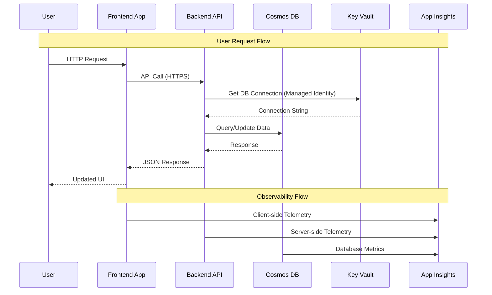

#### Data Storage Design
| Data Type | Storage Solution | Partitioning Strategy | Backup Strategy |
|-----------|------------------|----------------------|-----------------|
| **Bookmark Records** | Cosmos DB (SQL API) | Partition by user_id | Automatic backup (7-day retention) |
| **Application Configuration** | Azure Key Vault | N/A - Encrypted secrets | Geo-redundant backup |
| **Application Logs** | Application Insights | Time-based partitioning | 90-day retention |
| **Infrastructure State** | Azure Storage (Terraform) | Environment-based | Version control + backup |

### 1.4 Integration Architecture

#### Service Integration Patterns
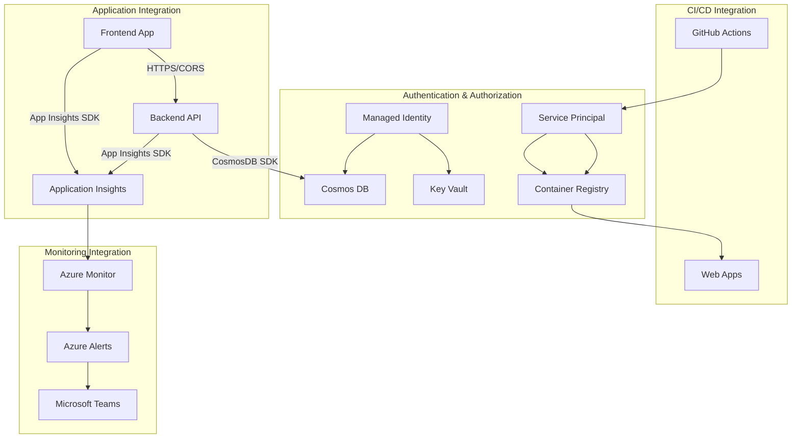

---

## 2. Technology Selection

### 2.1 Platform Choices (Aligned with tech-stack.md)

#### Core Infrastructure Stack
| Category | Technology | Justification | Alignment |
|----------|------------|---------------|-----------|
| **Infrastructure as Code** | Terraform | ✅ Standard per tech-stack.md | Full alignment |
| **Cloud Provider** | Microsoft Azure | ✅ Standard per tech-stack.md | Full alignment |
| **Application Hosting** | Azure App Service (Web Apps) | ✅ Standard per tech-stack.md | Full alignment |
| **CI/CD Platform** | GitHub Actions | ✅ Standard per tech-stack.md | Full alignment |
| **Container Registry** | Azure Container Registry | ⚠️ Deviation from Docker Hub | *Justification below* |

**Deviation Justification - Container Registry**:
- **Decision**: Use Azure Container Registry instead of Docker Hub
- **Rationale**:
  - Private registry required for enterprise security
  - Managed identity integration with Azure services
  - Better performance within Azure ecosystem
  - Cost-effective for enterprise use cases
- **Trade-offs**: Additional Azure service to manage vs. external dependency

#### Monitoring & Observability Stack
| Category | Technology | Justification | Alignment |
|----------|------------|---------------|-----------|
| **Application Monitoring** | Azure Application Insights | ✅ Standard per tech-stack.md | Full alignment |
| **Logging** | Azure Monitor Logs | ✅ Standard per tech-stack.md | Full alignment |
| **Metrics & Alerting** | Azure Monitor | ✅ Standard per tech-stack.md | Full alignment |
| **Error Tracking** | Azure Application Insights | ✅ Standard per tech-stack.md | Full alignment |

#### Security & Compliance Stack
| Category | Technology | Justification | Alignment |
|----------|------------|---------------|-----------|
| **Authentication** | Managed Identity | ✅ Azure AD family per tech-stack.md | Full alignment |
| **Secret Management** | Azure Key Vault | ✅ Standard per tech-stack.md | Full alignment |
| **Code Security** | GitHub Advanced Security | ✅ Standard per tech-stack.md | Full alignment |
| **Container Security** | Docker Scout + Azure Security | ✅ Standard + Azure enhancement | Enhanced alignment |

### 2.2 Framework Selection

#### Frontend Framework Stack
```json
{
  "framework": "React 18.2.0",
  "build_system": "Vite 4.3.0",
  "styling": "Tailwind CSS 3.3.0",
  "routing": "React Router DOM 6.8.0",
  "icons": "Lucide React 0.263.1",
  "monitoring": "Application Insights React Plugin"
}
```

**Production Optimizations**:
- Bundle splitting and lazy loading
- Asset optimization and compression
- CDN-ready static asset generation
- Environment-specific configuration injection

#### Backend Framework Stack
```python
{
  "framework": "FastAPI (latest stable)",
  "runtime": "Python 3.11",
  "database_client": "Azure Cosmos DB SDK",
  "validation": "Pydantic v2",
  "async_runtime": "uvicorn",
  "monitoring": "Application Insights Python SDK"
}
```

**Production Optimizations**:
- Async/await throughout the application
- Connection pooling for database connections
- Structured logging with correlation IDs
- Health check endpoints with dependency validation

---

## 3. Detailed Component Design

### 3.1 Core Infrastructure Components

#### Terraform Module Architecture
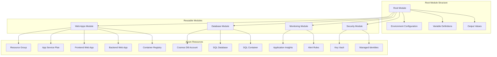

#### Component Responsibilities

**Web Apps Module (`catalog/terraform_modules/bookmarks_web_apps/`)**
- Resource group provisioning and management
- App Service Plan configuration with appropriate SKUs
- Frontend and backend Web App provisioning
- Container registry setup and configuration
- Managed identity assignment and RBAC

**Database Module (within Web Apps Module)**
- Cosmos DB account with serverless configuration
- SQL database and container provisioning
- Backup and retention policy configuration
- Performance and scaling configuration

**Monitoring Module (within Web Apps Module)**
- Application Insights workspace provisioning
- Custom metrics and telemetry configuration
- Alert rule configuration for SLA monitoring
- Dashboard template deployment

**Security Module (within Web Apps Module)**
- Azure Key Vault provisioning
- Secret and certificate management
- Access policy configuration
- Managed identity role assignments

### 3.2 CI/CD Pipeline Components

#### GitHub Actions Workflow Architecture
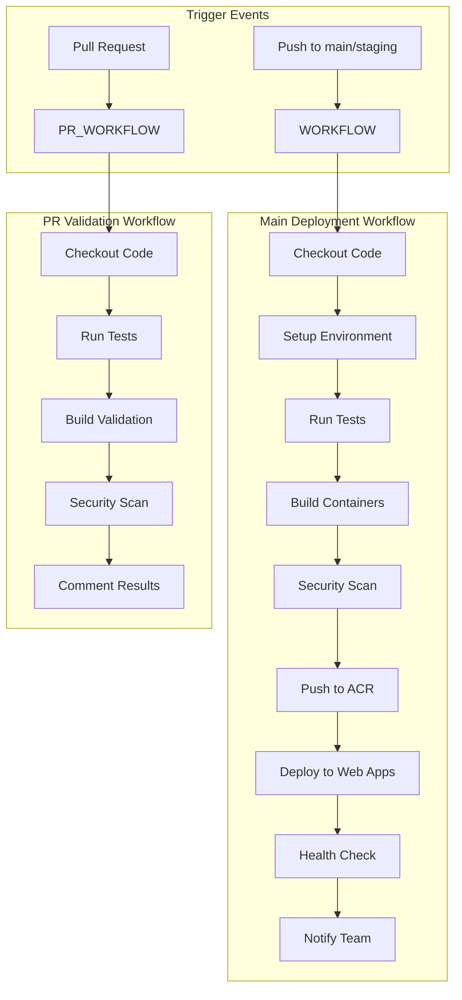

#### Pipeline Component Specifications

**Frontend Build Pipeline**
```yaml
# .github/workflows/frontend-deploy.yml
name: Frontend Deployment
on:
  push:
    branches: [main, staging]
    paths: ['src/frontend/**', '.github/workflows/frontend-deploy.yml']

jobs:
  build-and-deploy:
    runs-on: ubuntu-latest
    steps:
      - name: Checkout code
      - name: Setup Node.js 18
      - name: Install dependencies
      - name: Run tests
      - name: Build production bundle
      - name: Build Docker image
      - name: Scan for vulnerabilities
      - name: Push to ACR
      - name: Deploy to Web App
      - name: Health check validation
```

**Backend Build Pipeline**
```yaml
# .github/workflows/backend-deploy.yml
name: Backend Deployment
on:
  push:
    branches: [main, staging]
    paths: ['src/backend/**', 'requirements.txt', '.github/workflows/backend-deploy.yml']

jobs:
  build-and-deploy:
    runs-on: ubuntu-latest
    steps:
      - name: Checkout code
      - name: Setup Python 3.11
      - name: Install dependencies
      - name: Run tests and linting
      - name: Build Docker image
      - name: Scan for vulnerabilities
      - name: Push to ACR
      - name: Deploy to Web App
      - name: Health check validation
```

### 3.3 Application Component Design

#### Frontend Application Architecture
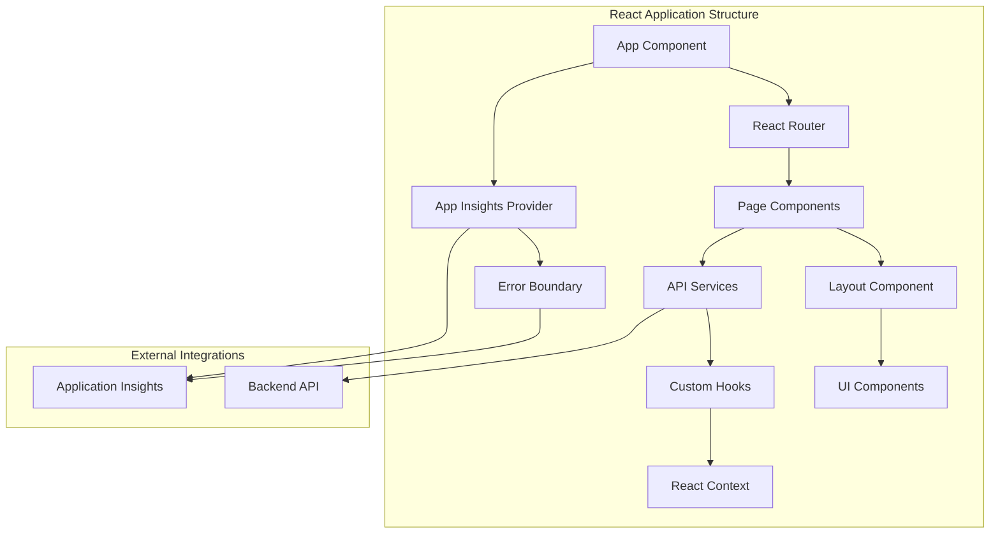

**Frontend Component Specifications**:
- **App Component**: Root component with routing and global providers
- **Layout Component**: Common layout with theme toggle and navigation
- **Page Components**: Dashboard, BookmarkManager with lazy loading
- **UI Components**: BookmarkCard, BookmarkForm, SearchBar, CategoryFilter
- **Services**: API client with error handling and retry logic
- **Hooks**: useTheme, useBookmarks, useApiCall for state management
- **Monitoring**: Application Insights integration for user analytics

#### Backend Application Architecture
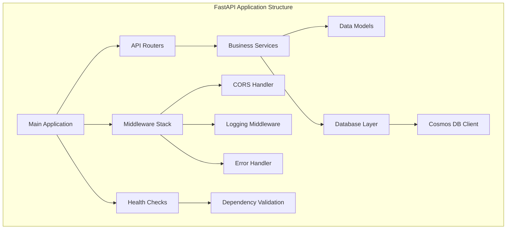

**Backend Component Specifications**:
- **Main Application**: FastAPI app with middleware and router configuration
- **API Routers**: `/api/v1/bookmarks` with full CRUD operations
- **Business Services**: BookmarkService with validation and business logic
- **Data Models**: Pydantic models for request/response validation
- **Database Layer**: Cosmos DB client with connection pooling
- **Health Checks**: `/health` endpoint with dependency validation
- **Middleware**: CORS, logging, error handling, and request tracing

---

## 4. Cross-Cutting Concerns

### 4.1 Security Design

#### Authentication and Authorization Architecture
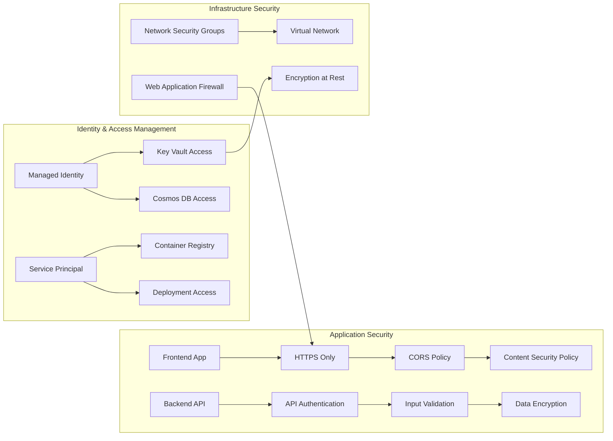

#### Security Implementation Details

**Network Security**:
- HTTPS enforcement for all external communication
- Network Security Groups with restrictive rules
- Private endpoints for Key Vault and Cosmos DB (production)
- Web Application Firewall for additional protection

**Data Protection**:
- Encryption at rest using Azure-managed keys
- Encryption in transit using TLS 1.2+
- Secrets stored in Azure Key Vault with rotation capability
- Database encryption using Cosmos DB transparent encryption

**Application Security**:
- Input validation using Pydantic models
- SQL injection prevention through parameterized queries
- XSS protection through Content Security Policy
- CORS policy restricting cross-origin requests

### 4.2 Observability Design

#### Monitoring and Alerting Architecture
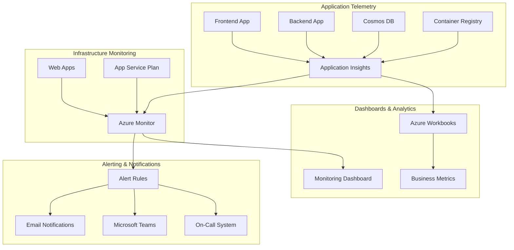

#### Observability Implementation

**Application Metrics**:
- Custom business metrics for bookmark operations (create, read, update, delete)
- User session tracking and engagement metrics
- API performance metrics (response time, throughput, error rate)
- Frontend performance metrics (page load time, bundle size)

**Infrastructure Metrics**:
- Web App performance (CPU, memory, network utilization)
- App Service Plan scaling metrics
- Cosmos DB performance (RU consumption, query performance)
- Container Registry metrics (image pulls, storage usage)

**Alert Configuration**:
```yaml
Critical Alerts (PagerDuty):
  - Application error rate > 5% (5-minute window)
  - API response time > 2 seconds (95th percentile, 10-minute window)
  - Web App availability < 99% (5-minute window)
  - Cosmos DB throttling detected

Warning Alerts (Email/Teams):
  - High CPU utilization > 80% (15-minute window)
  - Memory usage > 85% (15-minute window)
  - Unusual traffic patterns detected
  - Cost anomalies detected
```

### 4.3 Performance Design

#### Caching and Optimization Strategy
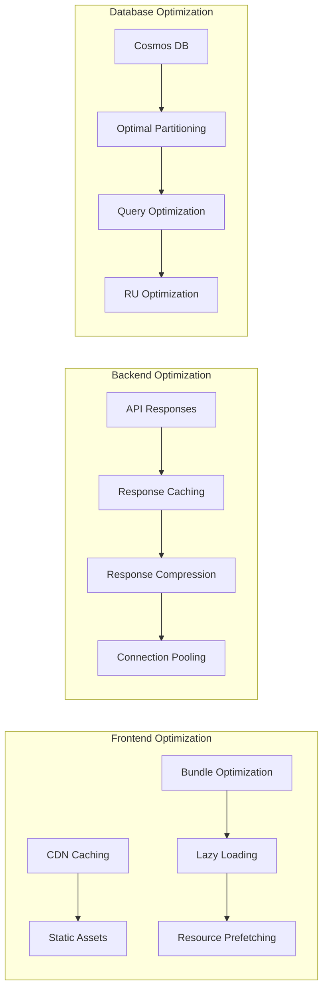

**Performance Implementation Details**:

**Frontend Performance**:
- Vite build optimization with tree shaking
- Code splitting and lazy loading for routes
- Asset compression and caching headers
- CDN integration for static asset delivery (future enhancement)

**Backend Performance**:
- Async/await throughout the application stack
- Connection pooling for Cosmos DB connections
- Response compression with gzip
- Query optimization with proper indexing

**Database Performance**:
- Partition key optimization (user_id for user isolation)
- Composite indexes for common query patterns
- Request Unit (RU) optimization and monitoring
- Serverless scaling for cost-effective performance

### 4.4 Resilience Design

#### Fault Tolerance and Recovery Patterns
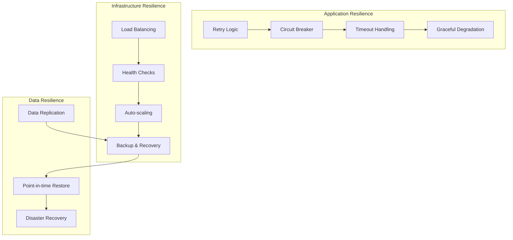

**Resilience Implementation**:

**Application-Level Resilience**:
- Retry logic with exponential backoff for transient failures
- Circuit breaker patterns for external service dependencies
- Timeout handling for all external calls
- Graceful degradation when non-critical services are unavailable

**Infrastructure Resilience**:
- Azure Web Apps automatic scaling and health monitoring
- Multi-zone deployment for high availability
- Automated failover for critical services
- Infrastructure as Code for rapid environment recreation

**Data Resilience**:
- Cosmos DB automatic failover and geo-replication
- Continuous backup with 7-day retention
- Point-in-time restore capability
- Terraform state backup and version control

---

## 5. Implementation Strategy

### 5.1 Module Breakdown and Development Approach

#### Phase 1: Infrastructure Foundation (Sprint 1)
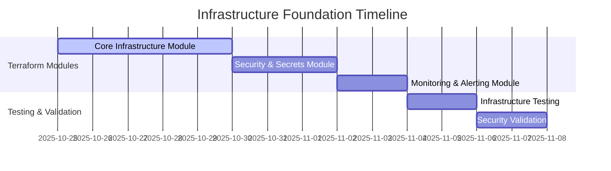

**Deliverables**:
- Complete Terraform module in `catalog/terraform_modules/bookmarks_web_apps/`
- Azure Resource Group, App Service Plan, and Web Apps
- Azure Container Registry with managed identity integration
- Basic Cosmos DB provisioning with proper partitioning
- Azure Key Vault with secret management
- Application Insights with basic monitoring

**Acceptance Criteria**:
- [ ] `terraform apply` provisions complete infrastructure
- [ ] All resources follow naming conventions: `{env}-{project}-{resource}`
- [ ] Managed identities configured for all Web Apps
- [ ] Terraform state managed in Azure Storage backend
- [ ] Infrastructure can be destroyed and recreated without data loss

#### Phase 2: CI/CD Pipeline (Sprint 2)
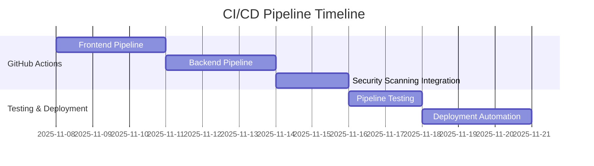

**Deliverables**:
- GitHub Actions workflows for frontend and backend
- Automated container builds with multi-stage Dockerfiles
- Security scanning integration (vulnerability assessment)
- Automated deployment to Azure Web Apps
- Rollback capabilities and health check validation

**Acceptance Criteria**:
- [ ] Code push triggers automated build and deployment
- [ ] Container images built and pushed to ACR within 5 minutes
- [ ] Deployment completes end-to-end within 10 minutes
- [ ] Health checks validate successful deployment
- [ ] Failed deployments trigger automatic rollback

#### Phase 3: Monitoring and Security (Sprint 3)
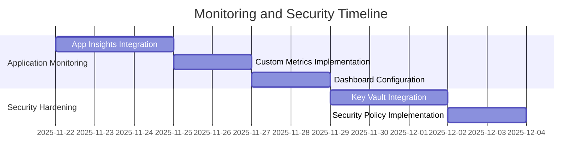

**Deliverables**:
- Application Insights integration in both frontend and backend
- Custom business metrics for bookmark operations
- Monitoring dashboards and alert configurations
- Complete Key Vault integration with managed identities
- Security policy implementation and compliance validation

**Acceptance Criteria**:
- [ ] All application telemetry flows to Application Insights
- [ ] Custom metrics track business KPIs
- [ ] Alerts configured for critical failures and performance issues
- [ ] All secrets managed through Azure Key Vault
- [ ] Security scanning shows no critical vulnerabilities

#### Phase 4: Testing and Documentation (Sprint 4)
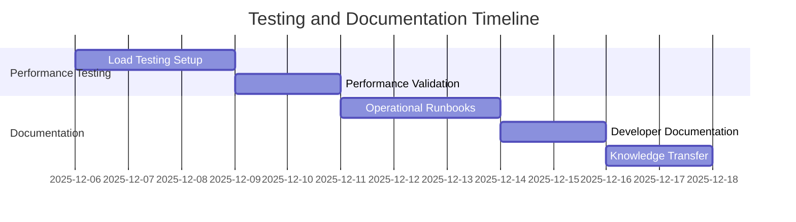

**Deliverables**:
- Load testing framework and performance validation
- Operational runbooks and troubleshooting guides
- Developer documentation and getting started guides
- Knowledge transfer sessions and training materials

**Acceptance Criteria**:
- [ ] System meets all performance requirements under load
- [ ] Complete operational documentation available
- [ ] Developer onboarding process documented and tested
- [ ] Team trained on operational procedures

### 5.2 Dependency Management

#### Build Order and Integration Points
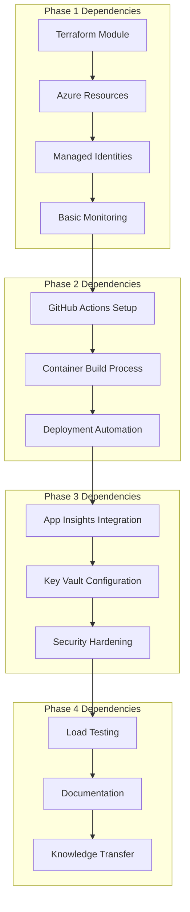

**Critical Path Dependencies**:
1. **Terraform Infrastructure** → Required for all subsequent phases
2. **Container Registry** → Required for CI/CD pipeline
3. **Managed Identities** → Required for secure service communication
4. **Basic Web Apps** → Required for deployment testing
5. **Key Vault** → Required for production security

### 5.3 Testing Strategy

#### Multi-Level Testing Approach
```mermaid
graph TD
    subgraph "Infrastructure Testing"
        TF_VALIDATE[Terraform Validate] --> TF_PLAN[Terraform Plan]
        TF_PLAN --> TF_APPLY[Test Apply]
        TF_APPLY --> TF_DESTROY[Test Destroy]
    end

    subgraph "Application Testing"
        UNIT[Unit Tests] --> INTEGRATION[Integration Tests]
        INTEGRATION --> CONTRACT[Contract Tests]
        CONTRACT --> E2E[End-to-End Tests]
    end

    subgraph "Performance Testing"
        LOAD[Load Testing] --> STRESS[Stress Testing]
        STRESS --> VOLUME[Volume Testing]
        VOLUME --> ENDURANCE[Endurance Testing]
    end

    subgraph "Security Testing"
        VULN[Vulnerability Scanning] --> SAST[Static Analysis]
        SAST --> DAST[Dynamic Analysis]
        DAST --> COMPLIANCE[Compliance Testing]
    end
```

**Testing Implementation Details**:

**Infrastructure Testing**:
- Terraform validation and linting with `tflint`
- Infrastructure testing with test environments
- Compliance testing with Azure Policy
- Cost validation with Azure Cost Management

**Application Testing**:
- Unit tests for business logic (>80% coverage)
- Integration tests for API endpoints
- Contract tests for frontend-backend communication
- End-to-end tests for critical user journeys

**Performance Testing**:
- Load testing with Azure Load Testing service
- Stress testing to identify breaking points
- Volume testing for data growth scenarios
- Endurance testing for memory leak detection

**Security Testing**:
- Container vulnerability scanning with Docker Scout
- Static code analysis with GitHub Advanced Security
- Dynamic security testing with OWASP ZAP
- Infrastructure security scanning with Azure Security Center

---

## 6. Architecture Decision Records (ADRs)

### ADR-001: Azure Web Apps for Container Hosting

**Context**: Need to select a container hosting platform for the React frontend and FastAPI backend applications.

**Options Considered**:
1. **Azure Web Apps for Containers**: PaaS solution with managed infrastructure
2. **Azure Container Apps**: Serverless container platform with event-driven scaling
3. **Azure Kubernetes Service**: Full container orchestration platform

**Decision**: Azure Web Apps for Containers

**Rationale**:
- **Alignment**: Matches tech-stack.md specification for Azure App Service
- **Simplicity**: Minimal operational overhead for development team
- **Cost-Effective**: Predictable pricing model suitable for budget constraints
- **Integration**: Native integration with Azure Container Registry and Application Insights
- **Scaling**: Built-in auto-scaling capabilities meet performance requirements

**Consequences**:
- ✅ Reduced operational complexity and management overhead
- ✅ Strong integration with Azure ecosystem
- ✅ Built-in health monitoring and auto-restart capabilities
- ❌ Less control over underlying infrastructure
- ❌ Limited customization compared to Kubernetes

### ADR-002: Azure Container Registry over Docker Hub

**Context**: Need to select a container registry for storing and managing Docker images.

**Options Considered**:
1. **Docker Hub**: Public registry as specified in tech-stack.md
2. **Azure Container Registry**: Private Azure-native registry
3. **GitHub Container Registry**: Integrated with GitHub ecosystem

**Decision**: Azure Container Registry

**Rationale**:
- **Security**: Private registry required for enterprise applications
- **Performance**: Better performance within Azure ecosystem
- **Integration**: Native managed identity integration with Azure services
- **Cost**: Competitive pricing for private registry usage
- **Compliance**: Meets enterprise security and compliance requirements

**Consequences**:
- ✅ Enhanced security with private container images
- ✅ Managed identity integration eliminates credential management
- ✅ Better performance for Azure-hosted applications
- ❌ Deviation from tech-stack.md specification
- ❌ Additional Azure service to manage and monitor

### ADR-003: Cosmos DB Serverless for Database Scaling

**Context**: Need to configure Azure Cosmos DB for optimal performance and cost efficiency.

**Options Considered**:
1. **Provisioned Throughput**: Fixed RU/s allocation
2. **Autoscale Provisioned**: Dynamic RU/s scaling within limits
3. **Serverless**: Pay-per-use model with automatic scaling

**Decision**: Cosmos DB Serverless

**Rationale**:
- **Cost Optimization**: Pay-per-use model aligns with budget constraints
- **Automatic Scaling**: No manual throughput management required
- **Development Friendly**: Ideal for development and testing environments
- **Predictable Workload**: Bookmark application has predictable access patterns

**Consequences**:
- ✅ Optimal cost for development and low-traffic scenarios
- ✅ Zero administrative overhead for throughput management
- ✅ Automatic scaling handles traffic spikes
- ❌ Higher cost per operation at scale
- ❌ Cold start latency for infrequent access patterns

### ADR-004: GitHub Actions for CI/CD Pipeline

**Context**: Need to implement CI/CD pipeline for automated build and deployment.

**Options Considered**:
1. **GitHub Actions**: Integrated with GitHub repository
2. **Azure DevOps**: Microsoft's dedicated DevOps platform
3. **Jenkins**: Self-hosted CI/CD solution

**Decision**: GitHub Actions

**Rationale**:
- **Alignment**: Matches tech-stack.md specification
- **Integration**: Native integration with GitHub repository
- **Simplicity**: No additional infrastructure to manage
- **Ecosystem**: Rich marketplace of actions and integrations
- **Cost**: Included with GitHub usage

**Consequences**:
- ✅ Seamless integration with source control
- ✅ No additional infrastructure or licensing costs
- ✅ Rich ecosystem of pre-built actions
- ❌ Potential vendor lock-in with GitHub
- ❌ Limited customization compared to self-hosted solutions

### ADR-005: Single Terraform Module Approach

**Context**: Need to determine Terraform module structure and organization strategy.

**Options Considered**:
1. **Monolithic Module**: Single module containing all resources
2. **Micromodule Approach**: Separate modules for each service type
3. **Layered Modules**: Infrastructure layers with dependencies

**Decision**: Single Terraform Module with Internal Organization

**Rationale**:
- **Simplicity**: Easier to manage dependencies and state
- **Team Expertise**: Matches current team Terraform experience level
- **Application Size**: Complexity doesn't justify micromodule overhead
- **Maintenance**: Simpler to maintain and troubleshoot

**Consequences**:
- ✅ Simplified dependency management
- ✅ Easier state management and troubleshooting
- ✅ Faster implementation and testing
- ❌ Less reusability for other projects
- ❌ Potential complexity growth over time

---

## 7. Risk Mitigation Strategies

### 7.1 Technical Risk Mitigation

#### TR-001: Azure Web Apps Performance Risk
**Risk**: Web Apps may not meet performance requirements under load
**Mitigation Strategy**:
- Implement comprehensive load testing during development
- Configure auto-scaling rules with appropriate metrics
- Use Application Insights for proactive performance monitoring
- Plan for SKU upgrades if performance thresholds are exceeded

**Implementation**:
```yaml
# Auto-scaling configuration
auto_scaling_rules:
  scale_out:
    metric: "CpuPercentage"
    threshold: 70
    increase_count: 1
  scale_in:
    metric: "CpuPercentage"
    threshold: 25
    decrease_count: 1
```

#### TR-002: Container Image Size Risk
**Risk**: Large container images cause slow deployments
**Mitigation Strategy**:
- Implement multi-stage Docker builds
- Use Alpine Linux base images
- Optimize package installations and caching
- Monitor image size in CI/CD pipeline

**Implementation**:
```dockerfile
# Multi-stage build example
FROM node:18-alpine AS builder
WORKDIR /app
COPY package*.json ./
RUN npm ci --only=production

FROM node:18-alpine AS production
WORKDIR /app
COPY --from=builder /app/node_modules ./node_modules
COPY . .
RUN npm run build
```

### 7.2 Operational Risk Mitigation

#### OR-001: Skills Gap Risk
**Risk**: Team lacks sufficient Azure/Terraform expertise
**Mitigation Strategy**:
- Structured training program for team members
- Pair programming sessions for knowledge transfer
- External consulting for complex implementations
- Comprehensive documentation and runbooks

**Training Plan**:
- Week 1: Terraform fundamentals and Azure provider
- Week 2: Azure Web Apps and Container Registry deep dive
- Week 3: Monitoring and security best practices
- Week 4: Hands-on workshops and troubleshooting

### 7.3 Security Risk Mitigation

#### SR-001: Container Vulnerability Risk
**Risk**: Container images contain security vulnerabilities
**Mitigation Strategy**:
- Automated vulnerability scanning in CI/CD pipeline
- Regular base image updates
- Security policy enforcement with fail-fast approach
- Runtime security monitoring

**Implementation**:
```yaml
# Security scanning in GitHub Actions
- name: Run Docker Scout
  uses: docker/scout-action@v1
  with:
    command: cves
    image: ${{ env.IMAGE_NAME }}
    sarif-file: sarif.output.json
    summary: true
```

---

## 8. Infrastructure Requirements

### 8.1 Compute Requirements

#### Development Environment
| Resource | Configuration | Justification |
|----------|---------------|---------------|
| **App Service Plan** | B1 (1 core, 1.75GB RAM) | Cost-effective for development |
| **Frontend Web App** | Linux container, 1 instance | Handles development traffic |
| **Backend Web App** | Linux container, 1 instance | Handles development API calls |
| **Auto-scaling** | Disabled | Fixed capacity for predictable costs |

#### Production Environment
| Resource | Configuration | Justification |
|----------|---------------|---------------|
| **App Service Plan** | S1 (1 core, 1.75GB RAM) | Performance and auto-scaling support |
| **Frontend Web App** | Linux container, 1-3 instances | Handles user traffic with scaling |
| **Backend Web App** | Linux container, 1-5 instances | API scaling based on demand |
| **Auto-scaling** | CPU-based (70% scale out, 25% scale in) | Automatic performance adjustment |

### 8.2 Storage Requirements

#### Database Configuration
| Component | Configuration | Retention | Backup |
|-----------|---------------|-----------|--------|
| **Cosmos DB** | Serverless, SQL API | Indefinite | 7-day automatic |
| **Database** | bookmarks_db | N/A | Point-in-time restore |
| **Container** | bookmarks (partition: /user_id) | N/A | Continuous backup |

#### Application Storage
| Component | Configuration | Purpose | Retention |
|-----------|---------------|---------|-----------|
| **Container Registry** | Basic SKU, 10GB | Docker images | 30 days (untagged) |
| **Application Insights** | 1GB/day ingestion | Telemetry data | 90 days |
| **Terraform State** | Azure Storage, geo-redundant | Infrastructure state | Version controlled |

### 8.3 Networking Requirements

#### Network Architecture
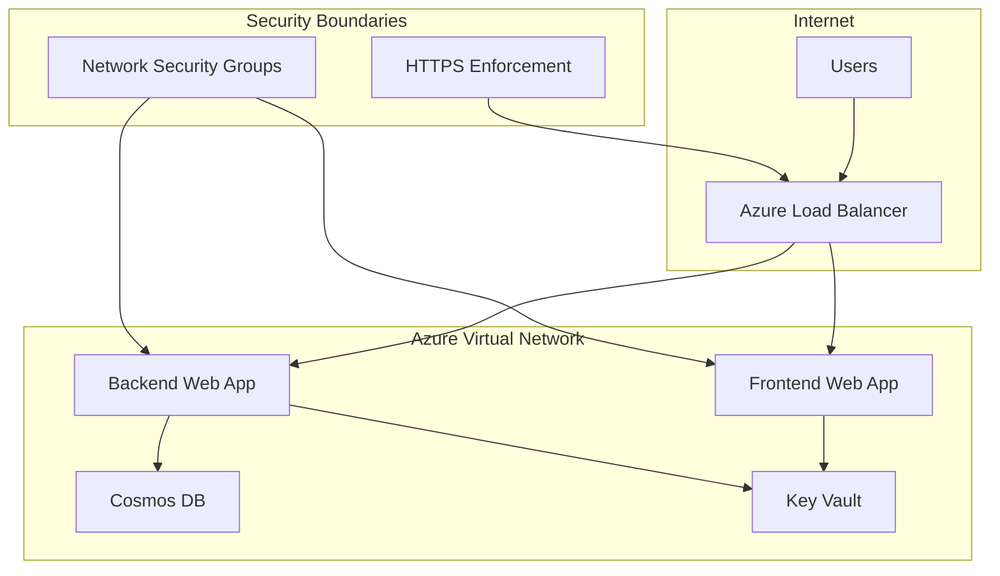

#### Network Security Configuration
| Component | Configuration | Purpose |
|-----------|---------------|---------|
| **HTTPS Enforcement** | TLS 1.2+ only | Encrypt all traffic |
| **CORS Policy** | Specific origins only | Prevent cross-origin attacks |
| **Network Security Groups** | Restrictive inbound/outbound | Network-level security |
| **Private Endpoints** | Key Vault, Cosmos DB (prod) | Internal-only access |

---

## 9. Implementation Roadmap

### 9.1 Detailed Sprint Planning

#### Sprint 1: Infrastructure Foundation (Weeks 1-2)
**Week 1 Tasks**:
- [ ] Create Terraform module structure in `catalog/terraform_modules/bookmarks_web_apps/`
- [ ] Implement core infrastructure resources (Resource Group, App Service Plan)
- [ ] Configure Azure Container Registry with managed identity
- [ ] Set up Terraform state backend in Azure Storage

**Week 2 Tasks**:
- [ ] Implement Web Apps for frontend and backend
- [ ] Configure Cosmos DB with serverless billing
- [ ] Set up Azure Key Vault with access policies
- [ ] Implement Application Insights basic configuration

**Acceptance Criteria**:
- [ ] Complete infrastructure provisioned with `terraform apply`
- [ ] All resources follow naming convention: `{env}-bookmarks-{resource}`
- [ ] Managed identities configured and tested
- [ ] Infrastructure can be destroyed and recreated

#### Sprint 2: CI/CD Pipeline (Weeks 3-4)
**Week 3 Tasks**:
- [ ] Create GitHub Actions workflow for frontend deployment
- [ ] Implement multi-stage Dockerfile optimization
- [ ] Configure automated testing in pipeline
- [ ] Set up container vulnerability scanning

**Week 4 Tasks**:
- [ ] Create GitHub Actions workflow for backend deployment
- [ ] Implement automated deployment to Web Apps
- [ ] Configure health check validation
- [ ] Implement rollback capabilities

**Acceptance Criteria**:
- [ ] Code push triggers automated build and deployment
- [ ] Deployment completes within 10 minutes
- [ ] Health checks validate successful deployment
- [ ] Rollback works within 5 minutes

#### Sprint 3: Monitoring and Security (Weeks 5-6)
**Week 5 Tasks**:
- [ ] Integrate Application Insights SDK in frontend and backend
- [ ] Configure custom business metrics
- [ ] Set up monitoring dashboards
- [ ] Configure alert rules for critical metrics

**Week 6 Tasks**:
- [ ] Complete Key Vault integration for all secrets
- [ ] Implement managed identity authentication
- [ ] Configure security scanning in pipelines
- [ ] Validate compliance requirements

**Acceptance Criteria**:
- [ ] All telemetry flows to Application Insights
- [ ] Custom metrics track bookmark operations
- [ ] Alerts configured and tested
- [ ] All secrets managed through Key Vault

#### Sprint 4: Testing and Documentation (Weeks 7-8)
**Week 7 Tasks**:
- [ ] Implement load testing framework
- [ ] Validate performance requirements
- [ ] Create operational runbooks
- [ ] Document troubleshooting procedures

**Week 8 Tasks**:
- [ ] Complete developer documentation
- [ ] Create getting started guides
- [ ] Conduct knowledge transfer sessions
- [ ] Finalize project handoff

**Acceptance Criteria**:
- [ ] System meets all performance requirements
- [ ] Complete operational documentation
- [ ] Team trained on procedures
- [ ] Project successfully handed off

### 9.2 Success Metrics and Validation

#### Technical Success Metrics
| Metric | Target | Measurement Method |
|--------|--------|-------------------|
| **Infrastructure Provisioning Time** | < 30 minutes | Terraform execution logs |
| **Deployment Time** | < 10 minutes | CI/CD pipeline metrics |
| **Application Startup Time** | < 60 seconds | Health check response time |
| **API Response Time** | < 500ms (95th percentile) | Application Insights |
| **Frontend Load Time** | < 3 seconds | Real User Monitoring |

#### Business Success Metrics
| Metric | Target | Measurement Method |
|--------|--------|-------------------|
| **Deployment Success Rate** | > 95% | GitHub Actions success rate |
| **System Uptime** | > 99.9% | Azure Monitor availability |
| **Developer Satisfaction** | > 4.5/5 | Team surveys |
| **Cost Efficiency** | < $100/month (dev) | Azure Cost Management |

---

## 10. Next Steps and Design Outputs

### 10.1 Immediate Actions for Implementation
1. **Repository Setup**: Create feature branch for infrastructure implementation
2. **Azure Subscription**: Prepare development Azure subscription with appropriate permissions
3. **Terraform Backend**: Set up Azure Storage for Terraform state management
4. **GitHub Secrets**: Configure repository secrets for Azure authentication

### 10.2 Design Handoff Package

**For Implementation Team (`/plan` command)**:
- Complete architectural specifications and component designs
- Detailed Terraform module structure and requirements
- CI/CD pipeline specifications with GitHub Actions workflows
- Security requirements and implementation guidelines
- Monitoring and alerting configuration specifications

**Technical Specifications Ready for Development**:
- [ ] Terraform module structure in `catalog/terraform_modules/bookmarks_web_apps/`
- [ ] Azure resource specifications with naming conventions
- [ ] GitHub Actions workflow templates
- [ ] Application Insights integration requirements
- [ ] Security and compliance implementation guidelines

**Documentation and Standards**:
- [ ] Architecture Decision Records for key technical decisions
- [ ] Performance and scalability requirements
- [ ] Security architecture and implementation guidelines
- [ ] Operational procedures and monitoring requirements

---

**Next Command**: `/plan` - Create detailed implementation plan and sprint breakdown

---

*This design document provides comprehensive technical architecture and implementation guidance for the Bookmarks platform infrastructure initiative. All components are designed following platform engineering principles to enable self-service capabilities while reducing cognitive load for development teams.*
