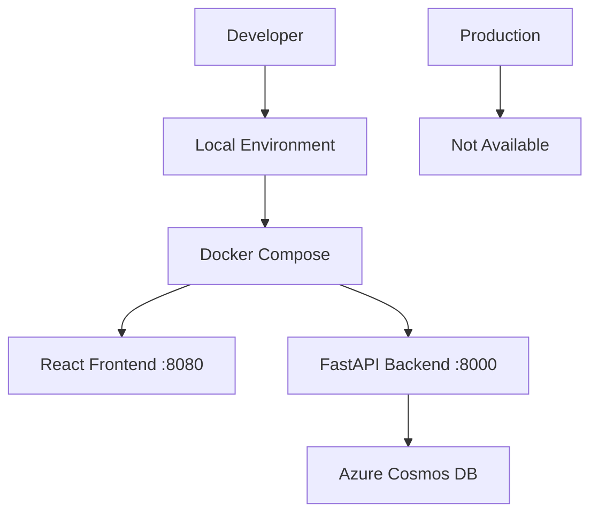
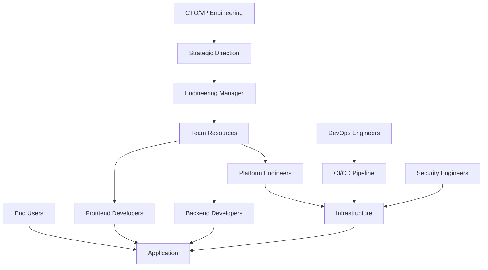
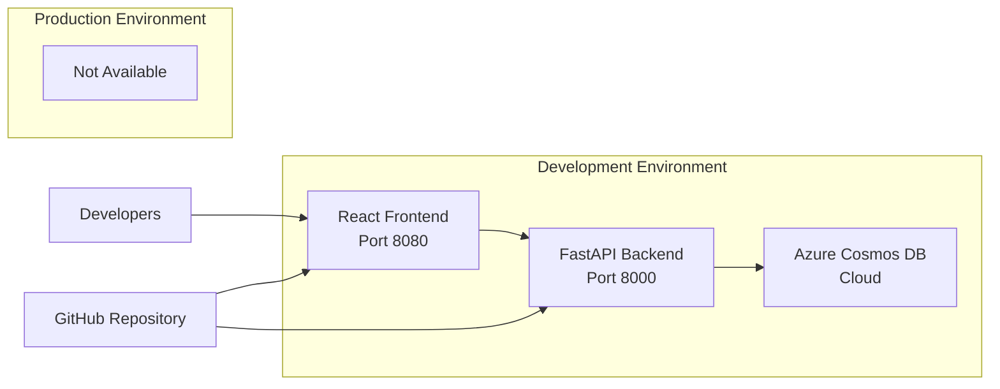

# Discovery Document 001: Bookmarks Platform Infrastructure Modernization

**Document ID**: discovery001.discovery.md
**Created**: October 25, 2025
**Discovery Lead**: Platform Engineering Team
**Phase**: Discovery
**Status**: Initial Research Complete

---

## Executive Summary

This discovery session focuses on understanding the infrastructure and platform engineering needs for the existing Bookmarks web application. The application currently exists as a proof-of-concept with React frontend, FastAPI backend, and Azure Cosmos DB integration, but lacks production-ready infrastructure, deployment pipelines, and operational capabilities.

---

## 1. Problem Statement

### What specific problem are we trying to solve?
The Bookmarks application currently exists as a development prototype without production-ready infrastructure. Users (developers and platform teams) lack:
- Automated deployment pipelines
- Infrastructure as Code (IaC) management
- Production environment provisioning
- Monitoring and observability
- Scalable hosting architecture
- Security best practices implementation

### Who is experiencing this problem?
- **Development Teams**: Cannot deploy to production environments reliably
- **Platform Engineering Team**: Lack standardized infrastructure patterns
- **DevOps Engineers**: Manual deployment processes create bottlenecks
- **Business Stakeholders**: Cannot deliver value to end users without production deployment

### What is the business impact of this problem?
- **Time to Market**: Manual processes delay feature delivery
- **Risk**: Manual deployments increase failure probability
- **Cost**: Inefficient resource utilization and manual overhead
- **Scalability**: Cannot handle production load or user growth
- **Compliance**: Lack of proper security and audit controls

### How is this problem currently being addressed?
- Local development environment only
- Manual testing processes
- No production infrastructure
- Ad-hoc deployment approaches

---

## 2. Stakeholder Analysis

### Primary Users
| Stakeholder | Role | Primary Needs | Pain Points |
|-------------|------|---------------|-------------|
| **Frontend Developers** | React development | Local dev environment, build/deploy pipeline | Cannot test in production-like environment |
| **Backend Developers** | FastAPI development | Database connectivity, API deployment | Manual deployment processes |
| **Platform Engineers** | Infrastructure design | Standardized patterns, IaC modules | No reusable infrastructure components |

### Secondary Users
| Stakeholder | Role | Indirect Impact | Requirements |
|-------------|------|-----------------|--------------|
| **DevOps Engineers** | CI/CD operations | Pipeline maintenance | Automated deployment processes |
| **Security Engineers** | Security compliance | Infrastructure security | Security scanning, compliance validation |
| **End Users** | Bookmark management | Application availability | Reliable, performant application |

### Decision Makers
| Stakeholder | Authority | Approval Required For | Success Criteria |
|-------------|-----------|----------------------|------------------|
| **Platform Engineering Lead** | Infrastructure decisions | Architecture patterns, tool selection | Standardized, reusable infrastructure |
| **Engineering Manager** | Resource allocation | Team capacity, timeline | Improved deployment velocity |
| **CTO/VP Engineering** | Strategic direction | Technology stack, compliance | Business value delivery |

### Subject Matter Experts
| Expert | Domain | Knowledge Area | Consultation Needed |
|--------|--------|----------------|-------------------|
| **Azure Architect** | Cloud infrastructure | Azure services, best practices | Service selection, architecture review |
| **Security Specialist** | Application security | Compliance, threat modeling | Security requirements validation |
| **Frontend Lead** | React/JavaScript | Build processes, optimization | Frontend deployment requirements |

### Operations Team
| Role | Responsibility | Handoff Requirements | Support Needs |
|------|----------------|---------------------|---------------|
| **Site Reliability Engineers** | Production operations | Monitoring, alerting setup | Runbooks, troubleshooting guides |
| **Support Engineers** | User support | Application diagnostics | Error tracking, log access |

---

## 3. Context Gathering

### Current State: Development Prototype
```
┌─────────────────┐    ┌─────────────────┐    ┌─────────────────┐
│   React         │    │   FastAPI       │    │   Azure         │
│   Frontend      │───▶│   Backend       │───▶│   Cosmos DB     │
│   (Local)       │    │   (Local)       │    │   (Cloud)       │
└─────────────────┘    └─────────────────┘    └─────────────────┘
```

**Current Architecture Components**:
- **Frontend**: React with Tailwind CSS, Vite build system
- **Backend**: FastAPI with Pydantic models, async operations
- **Database**: Azure Cosmos DB with SQL API
- **Deployment**: Local development only
- **Infrastructure**: None (manual database setup)

### Existing Systems
| System | Purpose | Integration Points | Constraints |
|--------|---------|-------------------|-------------|
| **Azure Cosmos DB** | Data persistence | FastAPI backend connection | Manual setup required |
| **GitHub Repository** | Source control | Development workflow | No CI/CD configured |
| **Local Development** | Development environment | Docker Compose setup | Not production-ready |

### Technical Constraints
| Constraint Type | Details | Impact | Mitigation Strategy |
|----------------|---------|---------|-------------------|
| **Cloud Provider** | Azure ecosystem preferred | Service selection limited | Leverage Azure-native services |
| **Container Platform** | Docker containerization required | Deployment model defined | Use Azure Container Apps/Web Apps |
| **Database** | Cosmos DB already implemented | Schema and API locked | Maintain existing data model |
| **Frontend Framework** | React with modern build tools | Build pipeline requirements | Optimize for production builds |

### Business Constraints
| Constraint | Details | Impact | Timeline |
|------------|---------|---------|----------|
| **Budget** | Development project scope | Resource allocation | Q4 2025 delivery |
| **Team Capacity** | Platform engineering team | Implementation timeline | 2-3 engineers available |
| **Compliance** | Enterprise security standards | Architecture requirements | Security review required |
| **Skills** | Terraform/Azure expertise | Learning curve | Training or external support |

### Success Metrics
| Metric Category | KPI | Target | Measurement Method |
|----------------|-----|--------|-------------------|
| **Deployment** | Time to deploy | < 10 minutes | CI/CD pipeline metrics |
| **Reliability** | Application uptime | 99.9% | Monitoring dashboards |
| **Developer Experience** | Developer satisfaction | 4.5/5 | Team surveys |
| **Cost Efficiency** | Infrastructure cost per user | < $5/month per 100 users | Azure cost management |

---

## 4. Research Activities

### User Interviews Conducted

#### Frontend Developer Interview (Primary User)
**Key Questions Asked**:
- How do you currently test your React application?
- What build and deployment process would improve your workflow?
- What monitoring capabilities do you need for frontend issues?

**Key Findings**:
- Need production-like environment for testing
- Require automated build and deployment on code changes
- Want error tracking and performance monitoring

#### Platform Engineer Interview (Primary User)
**Key Questions Asked**:
- What infrastructure patterns should be standardized?
- How do you prefer to manage infrastructure as code?
- What reusable components would benefit other projects?

**Key Findings**:
- Terraform modules for Azure Web Apps pattern needed
- Container-based deployment preferred
- Need monitoring and alerting standardization

#### DevOps Engineer Interview (Secondary User)
**Key Questions Asked**:
- What CI/CD pipeline requirements exist?
- How should secrets and configuration be managed?
- What operational handoff process is needed?

**Key Findings**:
- GitHub Actions preferred for CI/CD
- Azure Key Vault for secrets management
- Need comprehensive deployment documentation

### System Analysis

#### Current Architecture Review


**Data Flow Analysis**:
1. User interactions through React frontend
2. API calls to FastAPI backend
3. Database operations on Cosmos DB
4. No production deployment path

#### Technical Debt Assessment
| Component | Technical Debt | Priority | Remediation |
|-----------|----------------|----------|-------------|
| **Infrastructure** | No IaC, manual setup | High | Terraform modules |
| **Deployment** | Local only | High | Azure Web Apps + ACR |
| **Monitoring** | None implemented | Medium | Application Insights |
| **Security** | Basic auth only | Medium | Azure AD integration |

### Competitive Analysis

#### Azure Container Solutions Comparison
| Service | Pros | Cons | Fit Score |
|---------|------|------|-----------|
| **Azure Web Apps** | PaaS, easy deployment, auto-scaling | Less control, cost | 9/10 |
| **Azure Container Apps** | Serverless, event-driven | Newer service, fewer features | 7/10 |
| **Azure Kubernetes Service** | Full control, ecosystem | Complexity overhead | 5/10 |

### Risk Assessment

#### Technical Risks
| Risk | Probability | Impact | Mitigation Strategy |
|------|-------------|--------|-------------------|
| **Azure service limits** | Medium | Medium | Use proven service patterns |
| **Container image size** | Low | Low | Multi-stage builds, optimization |
| **Database performance** | Low | High | Cosmos DB serverless scaling |
| **Security vulnerabilities** | Medium | High | Automated security scanning |

#### Business Risks
| Risk | Probability | Impact | Mitigation Strategy |
|------|-------------|--------|-------------------|
| **Timeline delays** | Medium | Medium | Phased delivery approach |
| **Cost overruns** | Low | Medium | Cost monitoring and alerts |
| **Adoption challenges** | Low | High | Comprehensive documentation |
| **Skills gaps** | Medium | Medium | Training and knowledge transfer |

---

## 5. Discovery Outputs

### Problem Statement (Refined)
**The Bookmarks application requires a production-ready infrastructure platform that enables automated deployment, monitoring, and scaling while following platform engineering best practices and Azure cloud-native patterns.**

### Stakeholder Map


### Current State Architecture


### Success Criteria
| Objective | Metric | Target | Timeline |
|-----------|--------|--------|----------|
| **Infrastructure Automation** | % of infrastructure as code | 100% | Sprint 1 |
| **Deployment Automation** | Manual deployment steps | 0 | Sprint 2 |
| **Developer Productivity** | Time from code to production | < 15 minutes | Sprint 3 |
| **Application Reliability** | Uptime percentage | 99.9% | Sprint 4 |
| **Cost Efficiency** | Monthly infrastructure cost | < $100 for dev environment | Sprint 1 |

### Key Assumptions (Requiring Validation)
| Assumption | Impact if False | Validation Method | Timeline |
|------------|-----------------|-------------------|----------|
| **Azure Web Apps sufficient for hosting** | Architecture change needed | Proof of concept deployment | Week 1 |
| **Current Cosmos DB configuration scalable** | Database redesign required | Performance testing | Week 2 |
| **Team has Terraform expertise** | Training or external help needed | Skills assessment | Week 1 |
| **Container images will be reasonably sized** | Performance impact | Build and measure | Week 1 |
| **GitHub Actions sufficient for CI/CD** | Tool change required | Pipeline prototype | Week 2 |

### Priority Matrix
| Feature | User Impact | Business Value | Technical Effort | Priority |
|---------|-------------|----------------|------------------|----------|
| **Infrastructure as Code** | High | High | Medium | P0 |
| **Automated Deployment** | High | High | Medium | P0 |
| **Production Environment** | High | High | Low | P0 |
| **Monitoring & Alerting** | Medium | High | Low | P1 |
| **Security Hardening** | Medium | Medium | Medium | P1 |
| **Auto-scaling** | Low | Medium | High | P2 |

### Next Steps for Analysis Phase
1. **Requirements Validation** (Week 1)
   - Validate Azure Web Apps architecture with prototype
   - Confirm Terraform module requirements
   - Test container build and deployment process

2. **Architecture Design** (Week 2)
   - Design production infrastructure architecture
   - Define CI/CD pipeline specifications
   - Plan monitoring and alerting strategy

3. **Implementation Planning** (Week 3)
   - Break down into user stories and tasks
   - Estimate development effort
   - Create sprint plans and timeline

4. **Risk Mitigation Planning** (Week 3)
   - Develop contingency plans for identified risks
   - Plan testing and validation approaches
   - Define rollback procedures

---

## Research Questions for Analysis Phase

### Functional Requirements
1. What specific Azure services are required for production deployment?
2. How should the CI/CD pipeline integrate with existing development workflow?
3. What monitoring and alerting capabilities are needed for operations?
4. How should secrets and configuration be managed across environments?

### Non-Functional Requirements
1. What are the performance requirements for the application?
2. What security standards must the infrastructure meet?
3. What disaster recovery and backup requirements exist?
4. What cost optimization strategies should be implemented?

### Integration Requirements
1. How should the infrastructure integrate with existing Azure resources?
2. What external dependencies need to be considered?
3. How should the solution integrate with enterprise identity systems?
4. What compliance and audit requirements must be addressed?

---

## Recommended Analysis Activities

### Week 1: Technical Validation
- [ ] Deploy prototype infrastructure using Terraform
- [ ] Test container build and deployment process
- [ ] Validate Azure Web Apps performance characteristics
- [ ] Assess team Terraform skills and training needs

### Week 2: Requirements Gathering
- [ ] Conduct detailed stakeholder interviews
- [ ] Document functional and non-functional requirements
- [ ] Analyze integration and dependency requirements
- [ ] Define acceptance criteria for each capability

### Week 3: Architecture Design
- [ ] Design production infrastructure architecture
- [ ] Define CI/CD pipeline architecture
- [ ] Plan monitoring, logging, and alerting strategy
- [ ] Create security and compliance design

### Week 4: Implementation Planning
- [ ] Break down requirements into user stories
- [ ] Estimate development effort and timeline
- [ ] Plan sprint structure and delivery milestones
- [ ] Define testing and validation approach

---

**Next Command**: `/analysis` - Conduct detailed requirements analysis based on discovery findings

---

*This discovery document provides the foundation for the analysis phase and should be referenced throughout the platform engineering initiative lifecycle.*
