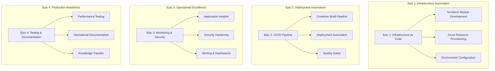
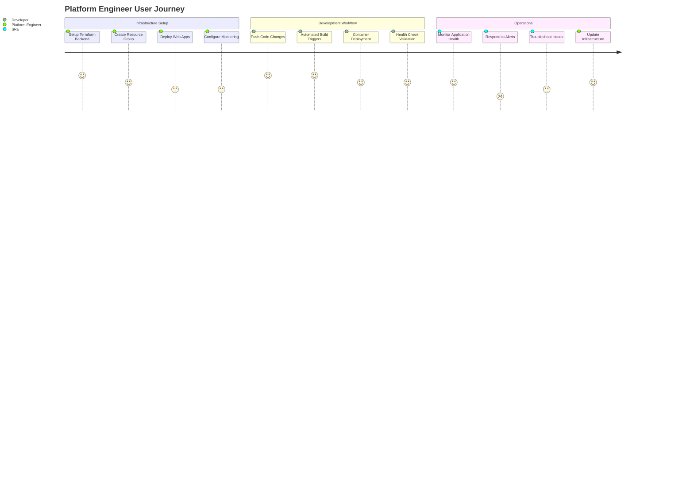
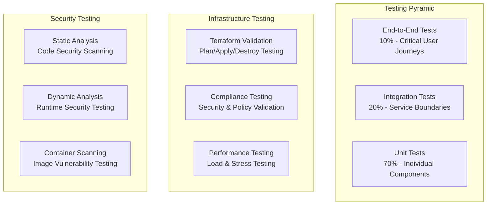
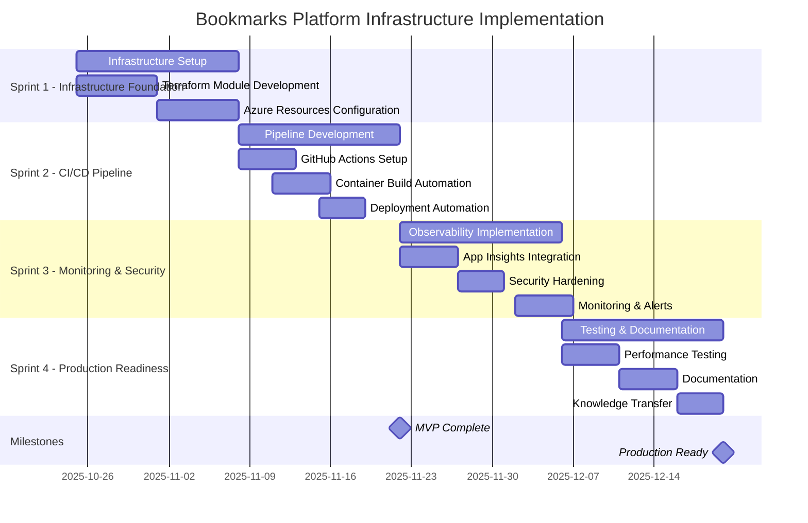
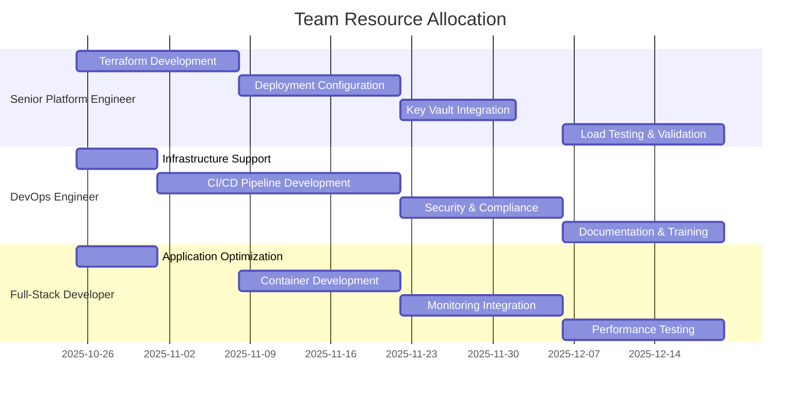

# Implementation Plan 001: Bookmarks Platform Infrastructure Development

**Document ID**: plan001.plan.md
**Created**: October 25, 2025
**Planning Lead**: Senior Platform Engineering Team Lead
**Phase**: Implementation Planning
**Status**: Sprint Planning Complete
**References**: [design001.design.md](../design/design001.design.md)

---

## Executive Summary

This implementation plan transforms the technical architecture from the design phase into actionable sprint plans with detailed story breakdown and estimation. The plan follows agile principles to deliver value incrementally while managing risks and dependencies effectively.

The implementation is structured into 4 sprints (8 weeks) delivering infrastructure automation, CI/CD pipelines, monitoring/security, and operational readiness. Each sprint has clear objectives, success criteria, and risk mitigation strategies.

---

## 1. Implementation Strategy

### 1.1 Work Breakdown Structure

#### Epic Definition and Business Value Mapping

#### Story Mapping: Platform Engineer Journey

### 1.2 Technical Architecture Implementation

#### Minimum Viable Product (MVP) Definition
**MVP Scope** (End of Sprint 2):
- ✅ Complete infrastructure provisioned via Terraform
- ✅ Automated container deployment via GitHub Actions
- ✅ Basic monitoring and health checks functional
- ✅ Production environment ready for application deployment

**MVP Success Criteria**:
- Infrastructure provisioning time < 30 minutes
- Deployment time < 10 minutes end-to-end
- Basic monitoring captures application health
- System meets 99% uptime requirement

#### Release Increments Strategy
| Release | Timeline | Value Delivered | Key Features |
|---------|----------|-----------------|--------------|
| **R1 - Infrastructure Foundation** | Week 2 | Platform automation capability | Terraform IaC, basic Azure resources |
| **R2 - Deployment Automation** | Week 4 | Developer self-service deployment | CI/CD pipelines, container automation |
| **R3 - Production Readiness** | Week 6 | Operational monitoring | Full observability, security hardening |
| **R4 - Operational Excellence** | Week 8 | Production support capability | Documentation, performance validation |

### 1.3 Dependency Management Framework

#### Critical Path Dependencies

```mermaid
graph LR
    subgraph "Sprint 1 Dependencies"
        A[Azure Subscription] --> B[Terraform Backend]
        B --> C[Core Infrastructure]
        C --> D[Managed Identities]
    end

    subgraph "Sprint 2 Dependencies"
        D --> E[Container Registry]
        E --> F[GitHub Actions Setup]
        F --> G[Deployment Pipeline]
    end

    subgraph "Sprint 3 Dependencies"
        G --> H[App Insights Integration]
        H --> I[Key Vault Configuration]
        I --> J[Security Scanning]
    end

    subgraph "Sprint 4 Dependencies"
        J --> K[Load Testing Setup]
        K --> L[Documentation]
        L --> M[Production Handoff]
    end
```

#### External Dependencies and Risk Mitigation
| Dependency | Owner | Risk Level | Impact | Mitigation Strategy |
|------------|-------|------------|--------|-------------------|
| **Azure Subscription Access** | IT Operations | High | Blocks all work | Pre-provisioned dev subscription, escalation path |
| **GitHub Repository Permissions** | Development Manager | Medium | Blocks CI/CD | Admin access confirmed, backup authentication |
| **Domain Expertise (Terraform)** | Platform Team | Medium | Quality/timeline | Training plan, external consulting on standby |
| **Security Review & Approval** | Security Team | Low | Production deployment | Early engagement, parallel security review |

---

## 2. Sprint Planning Framework

### 2.1 Team Capacity and Velocity

#### Team Composition and Skills Matrix
| Team Member | Primary Skills | Capacity (pts/sprint) | Sprint Focus |
|-------------|----------------|----------------------|--------------|
| **Senior Platform Engineer** | Terraform, Azure, Infrastructure | 20 points | Infrastructure design and implementation |
| **DevOps Engineer** | CI/CD, GitHub Actions, Automation | 18 points | Pipeline development and deployment |
| **Full-Stack Developer** | React, FastAPI, Container optimization | 16 points | Application optimization and integration |

**Total Team Velocity**: 54 story points per sprint
**Sprint Duration**: 2 weeks
**Buffer Allocation**: 15% (8 points) for unknown work and impediments

#### Capacity Planning Considerations
- **Sprint 1**: Full capacity available (54 points)
- **Sprint 2**: Full capacity available (54 points)
- **Sprint 3**: Reduced capacity due to Thanksgiving (40 points)
- **Sprint 4**: Full capacity available (54 points)

### 2.2 Definition of Ready and Done

#### Story-Level Definition of Ready
- [ ] **Acceptance Criteria** clearly defined and testable
- [ ] **Dependencies** identified and resolved or planned
- [ ] **Estimate** assigned by the team
- [ ] **Spike work** completed if required
- [ ] **Technical design** reviewed and approved
- [ ] **Resources and permissions** available

#### Sprint-Level Definition of Done
- [ ] **All stories** meet acceptance criteria
- [ ] **Automated tests** pass for all functionality
- [ ] **Code review** completed and approved
- [ ] **Documentation** updated for all changes
- [ ] **Security scanning** shows no critical vulnerabilities
- [ ] **Demo** prepared and stakeholder feedback collected

#### Release-Level Definition of Done
- [ ] **Performance requirements** validated through load testing
- [ ] **Security requirements** verified through compliance testing
- [ ] **Operational runbooks** complete and tested
- [ ] **Production deployment** successful with health validation
- [ ] **Monitoring and alerting** functional and tested
- [ ] **Knowledge transfer** completed to operations team

---

## 3. Sprint Structure and Detailed Planning

### 3.1 Sprint 1: Infrastructure Foundation (Weeks 1-2)

#### Sprint Goal
"Establish infrastructure automation capability that enables self-service environment provisioning with proper security and monitoring foundations."

#### Sprint Objectives and Value Delivery
- **Primary Value**: Platform engineers can provision complete environments via Terraform
- **Technical Progress**: Complete infrastructure automation with managed identities
- **Risk Reduction**: Validate Azure services integration and performance
- **Foundation**: Establish patterns for subsequent sprint automation

#### Sprint 1 Story Breakdown

##### Epic 1: Infrastructure as Code Implementation

**Story 1.1: Terraform Module Structure Setup** (5 points)
- **As a** Platform Engineer
- **I want** a standardized Terraform module structure
- **So that** I can efficiently manage infrastructure with consistent patterns

**Acceptance Criteria**:
- [ ] Module structure created in `catalog/terraform_modules/bookmarks_web_apps/`
- [ ] File organization follows platform standards (00-variables.tf, 01-main.tf, 02-outputs.tf)
- [ ] Variable validation implemented for all inputs
- [ ] Module supports multiple environments (dev, staging, prod)
- [ ] Documentation includes usage examples

**Technical Tasks**:
- Create module directory structure
- Implement variable definitions with validation
- Create locals for naming conventions
- Set up provider configurations
- Create basic README with examples

---

**Story 1.2: Azure Resource Group and App Service Plan** (8 points)
- **As a** Platform Engineer
- **I want** automated provisioning of core Azure resources
- **So that** I can create consistent hosting environments

**Acceptance Criteria**:
- [ ] Resource Group created with consistent naming: `{env}-bookmarks-rg`
- [ ] App Service Plan configured with appropriate SKU (B1 for dev, S1 for prod)
- [ ] All resources tagged with standard metadata
- [ ] Terraform state managed in Azure Storage backend
- [ ] Resources can be destroyed and recreated without issues

**Technical Tasks**:
- Implement Resource Group provisioning
- Configure App Service Plan with environment-specific SKUs
- Set up standard tagging strategy
- Configure Terraform backend for state management
- Test infrastructure provisioning and destruction

---

**Story 1.3: Azure Web Apps for Frontend and Backend** (8 points)
- **As a** Developer
- **I want** dedicated Web Apps for frontend and backend containers
- **So that** I can deploy applications independently with proper isolation

**Acceptance Criteria**:
- [ ] Frontend Web App created: `{env}-bookmarks-frontend-app`
- [ ] Backend Web App created: `{env}-bookmarks-backend-app`
- [ ] Both apps configured for Linux containers
- [ ] Health check paths configured (`/` for frontend, `/health` for backend)
- [ ] Apps configured with managed system identities

**Technical Tasks**:
- Implement Azure Web App resources
- Configure container deployment settings
- Set up health check monitoring
- Configure managed identities
- Test basic container deployment

---

**Story 1.4: Azure Container Registry Integration** (5 points)
- **As a** DevOps Engineer
- **I want** a private container registry with managed identity access
- **So that** I can securely store and deploy container images

**Acceptance Criteria**:
- [ ] Azure Container Registry created: `{env}bookmarksacr`
- [ ] Basic SKU configured for cost optimization
- [ ] Admin access enabled for CI/CD integration
- [ ] Web Apps configured with ACR pull permissions
- [ ] Registry accessible from deployment pipelines

**Technical Tasks**:
- Implement Azure Container Registry resource
- Configure registry SKU and settings
- Set up admin credentials
- Configure RBAC for Web Apps access
- Test container image push/pull operations

---

**Story 1.5: Cosmos DB Foundation Setup** (8 points)
- **As a** Backend Developer
- **I want** a managed NoSQL database with proper configuration
- **So that** I can persist bookmark data with performance and cost optimization

**Acceptance Criteria**:
- [ ] Cosmos DB account created: `{env}-bookmarks-cosmos`
- [ ] Serverless billing model configured
- [ ] SQL API enabled for application compatibility
- [ ] Database created: `bookmarks_db`
- [ ] Container created: `bookmarks` with `/id` partition key
- [ ] Connection strings available as Terraform outputs

**Technical Tasks**:
- Implement Cosmos DB account resource
- Configure serverless billing and consistency settings
- Create SQL database and container
- Set up partition key strategy
- Configure backup and retention policies
- Output connection information for applications

---

**Story 1.6: Azure Key Vault and Secrets Management** (6 points)
- **As a** Security Engineer
- **I want** centralized secrets management with managed identity access
- **So that** applications can securely access configuration without hardcoded secrets

**Acceptance Criteria**:
- [ ] Key Vault created: `{env}-bookmarks-kv`
- [ ] Access policies configured for Web App managed identities
- [ ] Initial secrets stored (Cosmos DB connection strings)
- [ ] Soft delete and purge protection enabled
- [ ] Audit logging configured

**Technical Tasks**:
- Implement Azure Key Vault resource
- Configure access policies for managed identities
- Store initial application secrets
- Configure vault settings and security policies
- Set up audit logging and monitoring

---

**Story 1.7: Basic Application Insights Setup** (5 points)
- **As a** Site Reliability Engineer
- **I want** basic monitoring and telemetry collection
- **So that** I can observe application health and performance

**Acceptance Criteria**:
- [ ] Application Insights workspace created: `{env}-bookmarks-ai`
- [ ] Connected to Web Apps for automatic telemetry collection
- [ ] Basic dashboards configured for key metrics
- [ ] Instrumentation keys available for application integration
- [ ] Basic alert rules configured for critical failures

**Technical Tasks**:
- Implement Application Insights resource
- Configure Web Apps integration
- Set up basic monitoring dashboards
- Create instrumentation key outputs
- Configure initial alert rules

---

**Story 1.8: Infrastructure Testing and Validation** (9 points)
- **As a** Platform Engineer
- **I want** comprehensive testing of infrastructure provisioning
- **So that** I can confidently deploy and manage environments

**Acceptance Criteria**:
- [ ] Complete infrastructure can be provisioned from scratch
- [ ] All resources properly configured and accessible
- [ ] Terraform plan/apply/destroy cycle works reliably
- [ ] All outputs and integrations functional
- [ ] Documentation updated with testing results

**Technical Tasks**:
- Create test environment provisioning
- Validate all resource configurations
- Test infrastructure destruction and recreation
- Verify all integrations and dependencies
- Document testing procedures and results

#### Sprint 1 Capacity Allocation
| Story | Points | Owner | Dependencies |
|-------|--------|-------|--------------|
| 1.1 Terraform Module Structure | 5 | Senior Platform Engineer | Azure subscription access |
| 1.2 Resource Group & App Service Plan | 8 | Senior Platform Engineer | Story 1.1 |
| 1.3 Azure Web Apps | 8 | Senior Platform Engineer | Story 1.2 |
| 1.4 Container Registry | 5 | DevOps Engineer | Story 1.2 |
| 1.5 Cosmos DB Setup | 8 | Senior Platform Engineer | Story 1.2 |
| 1.6 Key Vault & Secrets | 6 | DevOps Engineer | Story 1.3, 1.5 |
| 1.7 Application Insights | 5 | Full-Stack Developer | Story 1.3 |
| 1.8 Infrastructure Testing | 9 | All team members | All previous stories |

**Total Sprint 1**: 54 points (matches team capacity)

### 3.2 Sprint 2: CI/CD Pipeline Automation (Weeks 3-4)

#### Sprint Goal
"Enable developer self-service deployment with automated container builds, security scanning, and production deployment capabilities."

#### Sprint Objectives and Value Delivery
- **Primary Value**: Developers can deploy code changes automatically to production
- **Technical Progress**: Complete CI/CD automation with quality gates
- **Risk Reduction**: Validate deployment automation and rollback capabilities
- **Developer Experience**: Eliminate manual deployment overhead

#### Sprint 2 Story Breakdown

##### Epic 2: Deployment Pipeline Implementation

**Story 2.1: GitHub Actions Infrastructure Setup** (5 points)
- **As a** DevOps Engineer
- **I want** GitHub Actions workflows configured for container deployment
- **So that** code changes automatically trigger deployment pipelines

**Acceptance Criteria**:
- [ ] GitHub repository secrets configured for Azure authentication
- [ ] Service principal created with minimal required permissions
- [ ] Workflow templates created for frontend and backend
- [ ] Basic workflow triggers configured (push to main/staging branches)
- [ ] Azure CLI and Docker actions integrated

**Technical Tasks**:
- Create Azure service principal for GitHub Actions
- Configure repository secrets for Azure authentication
- Set up workflow directory structure
- Create workflow templates with Azure integration
- Test basic GitHub Actions connectivity

---

**Story 2.2: Frontend Container Build Pipeline** (8 points)
- **As a** Frontend Developer
- **I want** automated React application builds and container creation
- **So that** my code changes are automatically packaged for deployment

**Acceptance Criteria**:
- [ ] GitHub Actions workflow for frontend deployment
- [ ] Multi-stage Dockerfile optimized for production
- [ ] Node.js 18 environment with Vite build optimization
- [ ] Container image built and tagged with commit SHA
- [ ] Build artifacts optimized for size and performance

**Technical Tasks**:
- Create frontend GitHub Actions workflow
- Optimize frontend Dockerfile for production builds
- Configure Node.js build environment
- Implement container tagging strategy
- Optimize build performance and caching

---

**Story 2.3: Backend Container Build Pipeline** (8 points)
- **As a** Backend Developer
- **I want** automated FastAPI application builds and container creation
- **So that** my API changes are automatically packaged for deployment

**Acceptance Criteria**:
- [ ] GitHub Actions workflow for backend deployment
- [ ] Multi-stage Dockerfile optimized for Python production
- [ ] Python 3.11 environment with FastAPI optimization
- [ ] Container image built and tagged with commit SHA
- [ ] Health check endpoint validation in build

**Technical Tasks**:
- Create backend GitHub Actions workflow
- Optimize backend Dockerfile for production
- Configure Python build environment
- Implement health check validation
- Set up dependency caching and optimization

---

**Story 2.4: Container Security Scanning Integration** (5 points)
- **As a** Security Engineer
- **I want** automated vulnerability scanning for all container images
- **So that** only secure containers are deployed to production

**Acceptance Criteria**:
- [ ] Docker Scout integration in GitHub Actions
- [ ] Critical vulnerabilities block deployment
- [ ] Security scan results reported in pull requests
- [ ] Base image updates trigger security re-evaluation
- [ ] Security scan reports available for audit

**Technical Tasks**:
- Integrate Docker Scout in CI/CD pipelines
- Configure vulnerability scanning thresholds
- Set up security reporting in pull requests
- Configure automated base image updates
- Create security scan documentation

---

**Story 2.5: Azure Container Registry Push Automation** (6 points)
- **As a** DevOps Engineer
- **I want** automated container image publishing to Azure Container Registry
- **So that** built images are available for deployment

**Acceptance Criteria**:
- [ ] Container images automatically pushed to ACR after successful build
- [ ] Image tagging strategy implemented (latest, SHA, branch)
- [ ] Registry authentication via service principal
- [ ] Push operations complete within 2 minutes
- [ ] Failed pushes trigger appropriate alerts

**Technical Tasks**:
- Configure ACR authentication in GitHub Actions
- Implement image tagging and push logic
- Set up push performance optimization
- Configure error handling and retry logic
- Monitor push operations and timing

---

**Story 2.6: Azure Web Apps Deployment Automation** (10 points)
- **As a** Developer
- **I want** automated deployment of containers to Azure Web Apps
- **So that** my code changes reach production without manual intervention

**Acceptance Criteria**:
- [ ] Web Apps automatically pull new container images from ACR
- [ ] Deployment slots used for zero-downtime deployments
- [ ] Environment-specific configuration injected during deployment
- [ ] Deployment completes within 5 minutes
- [ ] Failed deployments trigger automatic rollback

**Technical Tasks**:
- Configure Web Apps container deployment
- Implement deployment slots for zero-downtime updates
- Set up environment variable injection
- Configure automatic rollback on health check failure
- Monitor deployment timing and success rates

---

**Story 2.7: Health Check and Validation Pipeline** (6 points)
- **As a** Site Reliability Engineer
- **I want** automated health validation after each deployment
- **So that** failed deployments are detected and rolled back quickly

**Acceptance Criteria**:
- [ ] Health check endpoints validated post-deployment
- [ ] Smoke tests run against deployed applications
- [ ] Failed health checks trigger automatic rollback
- [ ] Health check results reported in deployment status
- [ ] Custom health metrics collected

**Technical Tasks**:
- Implement health check validation in pipelines
- Create smoke test suites for both applications
- Configure automatic rollback triggers
- Set up health check reporting
- Create custom health metrics collection

---

**Story 2.8: Deployment Rollback Capabilities** (6 points)
- **As a** DevOps Engineer
- **I want** reliable rollback capabilities for failed deployments
- **So that** production issues can be quickly resolved

**Acceptance Criteria**:
- [ ] One-click rollback to previous container version
- [ ] Rollback completes within 3 minutes
- [ ] Database migration rollback strategy documented
- [ ] Rollback triggers and criteria clearly defined
- [ ] Rollback operations logged and auditable

**Technical Tasks**:
- Implement container version rollback mechanism
- Configure rollback triggers and automation
- Document database rollback procedures
- Set up rollback logging and audit trail
- Test rollback scenarios and timing

#### Sprint 2 Capacity Allocation
| Story | Points | Owner | Dependencies |
|-------|--------|-------|--------------|
| 2.1 GitHub Actions Setup | 5 | DevOps Engineer | Azure service principal |
| 2.2 Frontend Build Pipeline | 8 | Full-Stack Developer | Story 2.1 |
| 2.3 Backend Build Pipeline | 8 | Full-Stack Developer | Story 2.1 |
| 2.4 Security Scanning | 5 | DevOps Engineer | Story 2.2, 2.3 |
| 2.5 ACR Push Automation | 6 | DevOps Engineer | Story 2.2, 2.3 |
| 2.6 Web Apps Deployment | 10 | Senior Platform Engineer | Story 2.5 |
| 2.7 Health Check Pipeline | 6 | Full-Stack Developer | Story 2.6 |
| 2.8 Rollback Capabilities | 6 | DevOps Engineer | Story 2.6 |

**Total Sprint 2**: 54 points (matches team capacity)

### 3.3 Sprint 3: Monitoring and Security Hardening (Weeks 5-6)

#### Sprint Goal
"Implement comprehensive observability and security controls that enable production operations with confidence and compliance."

**Note**: Sprint 3 has reduced capacity (40 points) due to Thanksgiving holiday.

#### Sprint Objectives and Value Delivery
- **Primary Value**: Operations team can monitor and troubleshoot production systems
- **Technical Progress**: Complete observability and security implementation
- **Risk Reduction**: Validate monitoring, alerting, and security controls
- **Compliance**: Meet enterprise security and operational requirements

#### Sprint 3 Story Breakdown

##### Epic 3: Monitoring and Security Implementation

**Story 3.1: Application Insights SDK Integration** (8 points)
- **As a** Site Reliability Engineer
- **I want** comprehensive application telemetry and performance monitoring
- **So that** I can proactively identify and resolve issues

**Acceptance Criteria**:
- [ ] Application Insights SDK integrated in React frontend
- [ ] Application Insights SDK integrated in FastAPI backend
- [ ] Custom telemetry events for bookmark operations (CRUD)
- [ ] Performance counters and dependency tracking enabled
- [ ] User session and page view tracking configured

**Technical Tasks**:
- Integrate Application Insights React plugin
- Configure FastAPI Application Insights SDK
- Implement custom telemetry for business operations
- Set up performance and dependency tracking
- Configure user analytics and session tracking

---

**Story 3.2: Custom Business Metrics and Dashboards** (6 points)
- **As a** Product Manager
- **I want** business metrics tracking and visualization
- **So that** I can understand user engagement and system performance

**Acceptance Criteria**:
- [ ] Custom metrics for bookmark creation, reading, updating, deletion
- [ ] User engagement metrics (session duration, page views)
- [ ] System performance metrics (response times, error rates)
- [ ] Azure Workbooks dashboards for business and technical metrics
- [ ] Real-time metric updates with 1-minute granularity

**Technical Tasks**:
- Implement custom business metric collection
- Create Azure Workbooks dashboards
- Configure metric aggregation and visualization
- Set up real-time metric updates
- Create business and technical metric views

---

**Story 3.3: Alerting Rules and Notification Setup** (5 points)
- **As a** Site Reliability Engineer
- **I want** automated alerting for critical system failures and performance issues
- **So that** I can respond quickly to production problems

**Acceptance Criteria**:
- [ ] Critical alerts for application error rate > 5%
- [ ] Performance alerts for API response time > 2 seconds
- [ ] Availability alerts for uptime < 99%
- [ ] Cost anomaly alerts for budget overruns
- [ ] Alert notifications via email and Microsoft Teams

**Technical Tasks**:
- Configure Azure Monitor alert rules
- Set up notification channels (email, Teams)
- Define alert severity levels and escalation
- Test alert firing and notification delivery
- Document alert response procedures

---

**Story 3.4: Azure Key Vault Integration for All Secrets** (8 points)
- **As a** Security Engineer
- **I want** all application secrets managed through Azure Key Vault
- **So that** credentials are secure and auditable

**Acceptance Criteria**:
- [ ] Cosmos DB connection strings stored in Key Vault
- [ ] Application Insights instrumentation keys in Key Vault
- [ ] Web Apps configured to retrieve secrets via managed identity
- [ ] No hardcoded secrets in application code or configuration
- [ ] Secret access audit logging enabled

**Technical Tasks**:
- Migrate all secrets to Azure Key Vault
- Configure Web Apps Key Vault integration
- Update application code to use Key Vault references
- Remove hardcoded secrets from configuration
- Enable and test audit logging

---

**Story 3.5: Managed Identity Authentication Implementation** (6 points)
- **As a** Security Engineer
- **I want** Azure services to authenticate using managed identities
- **So that** credential management is eliminated and security is enhanced

**Acceptance Criteria**:
- [ ] Web Apps use managed identity for Cosmos DB access
- [ ] Web Apps use managed identity for Key Vault access
- [ ] Container Registry access via managed identity
- [ ] All service principal credentials removed from applications
- [ ] Managed identity permissions follow least privilege principle

**Technical Tasks**:
- Configure managed identity for all Web Apps
- Update application code for managed identity authentication
- Configure RBAC permissions for managed identities
- Remove service principal dependencies
- Test managed identity authentication flows

---

**Story 3.6: Security Compliance and Scanning Enhancement** (7 points)
- **As a** Compliance Officer
- **I want** comprehensive security scanning and compliance validation
- **So that** the system meets enterprise security standards

**Acceptance Criteria**:
- [ ] Infrastructure security scanning with Azure Security Center
- [ ] Application security scanning integrated in CI/CD
- [ ] Compliance policies enforced via Azure Policy
- [ ] Security configuration baseline documented
- [ ] Regular security scan reports generated

**Technical Tasks**:
- Configure Azure Security Center monitoring
- Enhance CI/CD security scanning
- Implement Azure Policy for compliance
- Document security configuration baseline
- Set up automated security reporting

#### Sprint 3 Capacity Allocation (Reduced: 40 points)
| Story | Points | Owner | Dependencies |
|-------|--------|-------|--------------|
| 3.1 App Insights SDK Integration | 8 | Full-Stack Developer | Application deployment |
| 3.2 Custom Metrics & Dashboards | 6 | Full-Stack Developer | Story 3.1 |
| 3.3 Alerting & Notifications | 5 | DevOps Engineer | Story 3.1 |
| 3.4 Key Vault Integration | 8 | Senior Platform Engineer | Key Vault setup |
| 3.5 Managed Identity Auth | 6 | Senior Platform Engineer | Story 3.4 |
| 3.6 Security Compliance | 7 | DevOps Engineer | Infrastructure complete |

**Total Sprint 3**: 40 points (adjusted for holiday capacity)

### 3.4 Sprint 4: Testing, Documentation, and Production Readiness (Weeks 7-8)

#### Sprint Goal
"Validate production readiness through comprehensive testing and deliver complete operational documentation for long-term system support."

#### Sprint Objectives and Value Delivery
- **Primary Value**: System validated for production workloads and operations team prepared
- **Technical Progress**: Performance validation and operational excellence
- **Risk Reduction**: Validate system under load and stress conditions
- **Knowledge Transfer**: Operations team fully trained and documented procedures

#### Sprint 4 Story Breakdown

##### Epic 4: Production Validation and Operational Excellence

**Story 4.1: Load Testing Framework Implementation** (10 points)
- **As a** Performance Engineer
- **I want** comprehensive load testing for the bookmark application
- **So that** I can validate system performance under expected and peak loads

**Acceptance Criteria**:
- [ ] Azure Load Testing service configured for the application
- [ ] Load test scenarios for normal usage (100 concurrent users)
- [ ] Stress test scenarios for peak usage (1000 concurrent users)
- [ ] Performance benchmarks established for API endpoints
- [ ] Load testing integrated into CI/CD pipeline for major releases

**Technical Tasks**:
- Set up Azure Load Testing service
- Create realistic load test scenarios
- Implement API endpoint performance testing
- Configure stress testing for system limits
- Integrate load testing in deployment pipeline

---

**Story 4.2: Performance Validation and Optimization** (8 points)
- **As a** Site Reliability Engineer
- **I want** validated system performance meeting all requirements
- **So that** production deployment meets SLA commitments

**Acceptance Criteria**:
- [ ] Frontend page load time < 3 seconds validated
- [ ] API response time < 500ms (95th percentile) validated
- [ ] Application startup time < 60 seconds validated
- [ ] Database query performance < 200ms validated
- [ ] Performance regression testing implemented

**Technical Tasks**:
- Execute comprehensive performance testing
- Validate all performance requirements
- Identify and resolve performance bottlenecks
- Implement performance regression testing
- Document performance optimization procedures

---

**Story 4.3: Disaster Recovery Testing and Validation** (6 points)
- **As a** Business Continuity Manager
- **I want** validated disaster recovery capabilities
- **So that** business operations can continue during outages

**Acceptance Criteria**:
- [ ] Infrastructure recreation from Terraform tested
- [ ] Database backup and restore procedures validated
- [ ] Application deployment rollback procedures tested
- [ ] Recovery Time Objective (RTO) < 15 minutes validated
- [ ] Disaster recovery runbook created and tested

**Technical Tasks**:
- Test complete infrastructure recreation
- Validate database backup and restore
- Test application rollback procedures
- Measure and validate RTO/RPO metrics
- Create disaster recovery documentation

---

**Story 4.4: Operational Runbooks and Procedures** (8 points)
- **As a** Operations Engineer
- **I want** comprehensive operational documentation
- **So that** I can effectively support the production system

**Acceptance Criteria**:
- [ ] Infrastructure management runbook completed
- [ ] Application deployment procedures documented
- [ ] Troubleshooting guide with common issues and solutions
- [ ] Monitoring and alerting response procedures
- [ ] Security incident response procedures

**Technical Tasks**:
- Create infrastructure management documentation
- Document deployment and rollback procedures
- Develop troubleshooting guides
- Create monitoring response procedures
- Document security incident response

---

**Story 4.5: Developer Documentation and Getting Started Guide** (6 points)
- **As a** New Developer
- **I want** comprehensive onboarding documentation
- **So that** I can quickly become productive with the system

**Acceptance Criteria**:
- [ ] Developer getting started guide completed
- [ ] Local development environment setup documented
- [ ] API documentation with examples
- [ ] Infrastructure modification procedures
- [ ] Contribution guidelines and code standards

**Technical Tasks**:
- Create developer onboarding documentation
- Document local development setup
- Create comprehensive API documentation
- Document infrastructure change procedures
- Create contribution guidelines

---

**Story 4.6: Knowledge Transfer and Training Sessions** (8 points)
- **As a** Team Lead
- **I want** knowledge transfer completed to operations and development teams
- **So that** the system can be maintained and enhanced long-term

**Acceptance Criteria**:
- [ ] Operations team training sessions completed
- [ ] Development team knowledge transfer sessions
- [ ] Documentation review and feedback incorporated
- [ ] Support escalation procedures established
- [ ] Knowledge transfer sign-off obtained

**Technical Tasks**:
- Conduct operations team training
- Execute developer team knowledge transfer
- Review and update all documentation
- Establish support procedures
- Obtain formal knowledge transfer approval

---

**Story 4.7: Production Deployment and Go-Live Validation** (8 points)
- **As a** Project Manager
- **I want** successful production deployment with full validation
- **So that** the system is ready for end-user access

**Acceptance Criteria**:
- [ ] Production environment fully deployed and configured
- [ ] All monitoring and alerting functional in production
- [ ] Security scanning shows no critical issues
- [ ] Performance validation completed in production
- [ ] Go-live checklist completed and signed off

**Technical Tasks**:
- Execute production deployment
- Validate all production configurations
- Complete security and performance validation
- Execute go-live checklist
- Obtain production readiness sign-off

#### Sprint 4 Capacity Allocation
| Story | Points | Owner | Dependencies |
|-------|--------|-------|--------------|
| 4.1 Load Testing Framework | 10 | Senior Platform Engineer | Complete system deployment |
| 4.2 Performance Validation | 8 | Full-Stack Developer | Story 4.1 |
| 4.3 Disaster Recovery Testing | 6 | DevOps Engineer | Complete infrastructure |
| 4.4 Operational Runbooks | 8 | DevOps Engineer | All system components |
| 4.5 Developer Documentation | 6 | Full-Stack Developer | System complete |
| 4.6 Knowledge Transfer | 8 | Senior Platform Engineer | Documentation complete |
| 4.7 Production Go-Live | 8 | All team members | All previous stories |

**Total Sprint 4**: 54 points (matches team capacity)

---

## 4. Quality Integration and Testing Strategy

### 4.1 Multi-Level Testing Framework

#### Test Pyramid Implementation

#### Testing Strategy by Sprint

**Sprint 1 Testing Focus**: Infrastructure Validation
- Terraform plan/apply/destroy cycle testing
- Resource configuration validation
- Integration testing between Azure services
- Security baseline validation

**Sprint 2 Testing Focus**: CI/CD Pipeline Validation
- Pipeline execution testing
- Container build and deployment testing
- Rollback mechanism validation
- Integration testing across environments

**Sprint 3 Testing Focus**: Monitoring and Security Validation
- Monitoring data flow testing
- Alert triggering and notification testing
- Security control validation
- Compliance testing

**Sprint 4 Testing Focus**: Production Readiness Validation
- Load and performance testing
- Disaster recovery testing
- End-to-end user journey testing
- Production deployment validation

### 4.2 Quality Gates and Checkpoints

#### Pipeline Quality Gates

```mermaid
graph LR
    subgraph "Build Stage"
        A[Code Commit] --> B[Unit Tests]
        B --> C[Static Analysis]
        C --> D[Build Artifacts]
    end

    subgraph "Security Stage"
        D --> E[Container Scan]
        E --> F[Security Tests]
        F --> G[Compliance Check]
    end

    subgraph "Deploy Stage"
        G --> H[Deploy to Staging]
        H --> I[Integration Tests]
        I --> J[Performance Tests]
    end

    subgraph "Release Stage"
        J --> K[Deploy to Production]
        K --> L[Health Checks]
        L --> M[Monitoring Validation]
    end
```

#### Definition of Done Quality Criteria

**Story-Level Quality Gates**:
- [ ] Unit test coverage > 80%
- [ ] All integration tests passing
- [ ] Security scan shows no critical vulnerabilities
- [ ] Code review completed and approved
- [ ] Documentation updated

**Sprint-Level Quality Gates**:
- [ ] All stories meet individual quality criteria
- [ ] Integration testing across all sprint features
- [ ] Performance impact assessment completed
- [ ] Security review completed
- [ ] Demo successfully delivered to stakeholders

**Release-Level Quality Gates**:
- [ ] Load testing validates performance requirements
- [ ] Security penetration testing completed
- [ ] Disaster recovery procedures validated
- [ ] Operational runbooks tested
- [ ] Production readiness checklist completed

---

## 5. Risk Management and Mitigation

### 5.1 Risk Assessment Matrix

#### High-Priority Risks (Probability: Medium-High, Impact: High)

**Risk R1: Azure Service Performance Limitations**
- **Probability**: Medium (40%)
- **Impact**: High (significant rework required)
- **Mitigation Strategy**:
  - Early load testing in Sprint 1
  - Performance monitoring during development
  - Auto-scaling configuration and testing
  - Alternative Azure service options identified

**Risk R2: Team Terraform Expertise Gap**
- **Probability**: Medium (50%)
- **Impact**: High (delays and quality issues)
- **Mitigation Strategy**:
  - Week 1 Terraform training for all team members
  - Pair programming with experienced engineer
  - External consultant on standby
  - Comprehensive code review process

**Risk R3: CI/CD Pipeline Complexity**
- **Probability**: Medium (35%)
- **Impact**: Medium (timeline delays)
- **Mitigation Strategy**:
  - Start with simple pipeline, iterate to add features
  - Extensive testing in development environment
  - Rollback plan for each pipeline change
  - Pipeline-as-code for version control

#### Medium-Priority Risks (Probability: Low-Medium, Impact: Medium)

**Risk R4: Security Compliance Delays**
- **Probability**: Low (25%)
- **Impact**: Medium (production deployment delay)
- **Mitigation Strategy**:
  - Early security team engagement
  - Automated compliance testing
  - Security reviews in parallel with development
  - Pre-approved security patterns

**Risk R5: Container Image Size Performance**
- **Probability**: Medium (45%)
- **Impact**: Low (deployment performance)
- **Mitigation Strategy**:
  - Multi-stage Docker builds from Sprint 2
  - Container optimization best practices
  - Image size monitoring in CI/CD
  - CDN integration for static assets

### 5.2 Risk Mitigation Timeline

| Sprint | Risk Mitigation Activities | Success Criteria |
|--------|---------------------------|------------------|
| **Sprint 1** | R2: Terraform training, R1: Performance baseline testing | Team Terraform competency, Performance benchmarks |
| **Sprint 2** | R3: Pipeline testing, R5: Container optimization | Pipeline reliability >95%, Container size <500MB |
| **Sprint 3** | R4: Security validation, R1: Load testing | Security approval, Performance under load |
| **Sprint 4** | All risks: Final validation and contingency activation | All risks mitigated or accepted |

### 5.3 Contingency Planning

#### Escalation Procedures
1. **Technical Issues**: Senior Platform Engineer → External Consultant → Vendor Support
2. **Timeline Issues**: Team Lead → Engineering Manager → Project Sponsor
3. **Resource Issues**: Team Lead → Resource Manager → Executive Sponsor
4. **Security Issues**: Security Engineer → Security Team Lead → CISO

#### Fallback Options
- **Infrastructure**: Manual Azure resource creation if Terraform fails
- **CI/CD**: Manual deployment process documented as backup
- **Monitoring**: Basic Azure Monitor if Application Insights fails
- **Security**: Staged security implementation if full compliance delayed

---

## 6. Success Metrics and Measurement

### 6.1 Sprint Success Metrics

#### Sprint 1 Success Criteria
| Metric | Target | Measurement Method | Critical Success Factor |
|--------|--------|-------------------|------------------------|
| **Infrastructure Provisioning Time** | < 30 minutes | Terraform execution logs | ✅ Critical |
| **Resource Creation Success Rate** | 100% | Terraform apply success | ✅ Critical |
| **Module Reusability** | 100% across environments | Environment deployment test | ✅ Critical |
| **Team Terraform Competency** | All members proficient | Skills assessment | ⚠️ Important |

#### Sprint 2 Success Criteria
| Metric | Target | Measurement Method | Critical Success Factor |
|--------|--------|-------------------|------------------------|
| **Deployment Pipeline Success Rate** | > 95% | GitHub Actions metrics | ✅ Critical |
| **End-to-End Deployment Time** | < 10 minutes | Pipeline execution time | ✅ Critical |
| **Container Build Time** | < 5 minutes | CI/CD build logs | ⚠️ Important |
| **Security Scan Integration** | 100% scans complete | Security tool reports | ✅ Critical |

#### Sprint 3 Success Criteria
| Metric | Target | Measurement Method | Critical Success Factor |
|--------|--------|-------------------|------------------------|
| **Monitoring Coverage** | 100% applications | Application Insights data | ✅ Critical |
| **Alert Response Time** | < 5 minutes | Alert system testing | ✅ Critical |
| **Security Compliance** | 100% requirements met | Compliance audit | ✅ Critical |
| **Secret Management** | 0 hardcoded secrets | Code security scan | ✅ Critical |

#### Sprint 4 Success Criteria
| Metric | Target | Measurement Method | Critical Success Factor |
|--------|--------|-------------------|------------------------|
| **Performance Under Load** | Meet all NFRs | Load testing results | ✅ Critical |
| **Documentation Completeness** | 100% coverage | Documentation review | ⚠️ Important |
| **Knowledge Transfer** | 100% team trained | Training completion | ⚠️ Important |
| **Production Readiness** | Go-live approved | Readiness checklist | ✅ Critical |

### 6.2 Project-Level Success Metrics

#### Technical Excellence Metrics
| Category | Metric | Target | Current Baseline | Measurement |
|----------|--------|--------|------------------|-------------|
| **Performance** | API Response Time (95th percentile) | < 500ms | TBD | Application Insights |
| **Performance** | Frontend Load Time | < 3 seconds | TBD | Real User Monitoring |
| **Reliability** | System Uptime | > 99.9% | TBD | Azure Monitor |
| **Security** | Critical Vulnerabilities | 0 | TBD | Security scanning tools |
| **Deployment** | Deployment Success Rate | > 95% | TBD | CI/CD metrics |

#### Business Value Metrics
| Category | Metric | Target | Measurement Method |
|----------|--------|--------|-------------------|
| **Cost Efficiency** | Monthly Infrastructure Cost (Dev) | < $100 | Azure Cost Management |
| **Cost Efficiency** | Monthly Infrastructure Cost (Prod) | < $500 | Azure Cost Management |
| **Developer Productivity** | Time from Code to Production | < 15 minutes | CI/CD pipeline metrics |
| **Team Satisfaction** | Developer Experience Rating | > 4.5/5 | Team surveys |
| **Operational Excellence** | Mean Time to Recovery | < 15 minutes | Incident tracking |

### 6.3 Continuous Improvement Framework

#### Retrospective Structure
**Sprint Retrospectives**: Focus on tactical improvements and impediment removal
- What went well in the sprint?
- What could be improved?
- What will we commit to improve in the next sprint?

**Project Retrospective**: Focus on strategic learnings and process improvements
- What platform engineering practices worked well?
- What would we do differently in future projects?
- What knowledge should be captured for the organization?

#### Metrics-Driven Improvement
- **Weekly Metrics Review**: Track progress against success criteria
- **Sprint Metrics Analysis**: Identify trends and improvement opportunities
- **Post-Project Metrics Assessment**: Validate final outcomes and learnings

---

## 7. Implementation Roadmap and Timeline

### 7.1 Project Timeline Overview

### 7.2 Critical Milestones and Deliverables

#### Milestone 1: Infrastructure Foundation Complete (End of Sprint 1)
**Date**: November 8, 2025
**Success Criteria**:
- [ ] Complete infrastructure provisioned via Terraform
- [ ] All Azure resources properly configured and connected
- [ ] Infrastructure can be destroyed and recreated reliably
- [ ] Basic monitoring and security foundations in place

#### Milestone 2: MVP Deployment Automation (End of Sprint 2)
**Date**: November 22, 2025
**Success Criteria**:
- [ ] Automated deployment pipeline functional end-to-end
- [ ] Developers can deploy code changes within 10 minutes
- [ ] Container security scanning prevents vulnerable deployments
- [ ] Rollback capabilities tested and functional

#### Milestone 3: Production Monitoring and Security (End of Sprint 3)
**Date**: December 6, 2025
**Success Criteria**:
- [ ] Comprehensive monitoring and alerting operational
- [ ] All security controls implemented and validated
- [ ] System meets enterprise compliance requirements
- [ ] Operations team can effectively monitor system health

#### Milestone 4: Production Readiness (End of Sprint 4)
**Date**: December 20, 2025
**Success Criteria**:
- [ ] System validated for production workloads
- [ ] Complete operational documentation available
- [ ] Team trained and knowledge transfer complete
- [ ] Go-live approval obtained

### 7.3 Resource Allocation and Dependencies

#### Team Member Sprint Allocation

#### External Dependencies Timeline
| Dependency | Required By | Owner | Status | Risk Level |
|------------|-------------|-------|--------|------------|
| **Azure Subscription Setup** | Sprint 1 Start | IT Operations | ✅ Confirmed | Low |
| **GitHub Repository Access** | Sprint 2 Start | Development Manager | ✅ Confirmed | Low |
| **Security Team Review** | Sprint 3 Start | Security Team | 📅 Scheduled | Medium |
| **Production Environment Approval** | Sprint 4 Start | Engineering Manager | 📅 Pending | Medium |

---

## 8. Handoff and Next Steps

### 8.1 Implementation Readiness Checklist

#### Pre-Sprint 1 Prerequisites
- [ ] **Azure Subscription**: Development subscription provisioned with appropriate permissions
- [ ] **Team Training**: Terraform fundamentals training completed
- [ ] **Repository Setup**: Feature branch created for infrastructure development
- [ ] **Tools Setup**: Terraform, Azure CLI, Docker installed on development machines
- [ ] **Access Verification**: All team members can access Azure resources and GitHub repository

#### Stakeholder Alignment
- [ ] **Project Sponsor**: Implementation plan approved and timeline confirmed
- [ ] **Security Team**: Security requirements reviewed and implementation approach approved
- [ ] **Operations Team**: Handoff expectations and support model agreed
- [ ] **Development Team**: Implementation impact on current development understood

### 8.2 Success Criteria for Plan Execution

#### Sprint-Level Success Validation
Each sprint will be considered successful when:
- All sprint objectives achieved
- Sprint demo successfully delivered to stakeholders
- No critical impediments remain unresolved
- Team velocity maintained within expected range
- Quality gates passed for all deliverables

#### Project-Level Success Validation
The project will be considered successful when:
- All functional and non-functional requirements met
- System successfully deployed and validated in production
- Operations team trained and supporting the system
- Developer self-service capabilities fully operational
- Cost targets achieved and validated

### 8.3 Post-Implementation Activities

#### Immediate Post-Implementation (Week 9)
- [ ] **Production Monitoring**: 24/7 monitoring for first week
- [ ] **Performance Validation**: Real user performance data collection
- [ ] **Issue Resolution**: Rapid response to any production issues
- [ ] **Stakeholder Communication**: Success metrics reporting

#### Long-Term Support Planning (Month 2-3)
- [ ] **Operational Excellence**: Continuous improvement of operational procedures
- [ ] **Performance Optimization**: Based on real usage patterns
- [ ] **Cost Optimization**: Analysis and optimization of resource usage
- [ ] **Feature Enhancement**: Planning for additional platform capabilities

---

## 9. Conclusion

This implementation plan provides a comprehensive roadmap for delivering the Bookmarks platform infrastructure following platform engineering best practices. The plan balances technical excellence with practical delivery constraints, ensuring both immediate value delivery and long-term maintainability.

### Key Success Factors
1. **Incremental Value Delivery**: Each sprint delivers working functionality
2. **Risk Mitigation**: Early identification and mitigation of high-risk items
3. **Quality Integration**: Quality gates ensure production readiness
4. **Team Development**: Skills building and knowledge transfer throughout
5. **Stakeholder Engagement**: Regular communication and feedback loops

### Implementation Confidence
With proper execution of this plan, the team will deliver:
- **Infrastructure automation** that enables self-service environment provisioning
- **Deployment automation** that reduces developer cognitive load
- **Operational excellence** that ensures reliable production support
- **Platform patterns** that can be reused for future projects

The plan provides sufficient detail for immediate execution while maintaining flexibility to adapt to changing requirements and lessons learned during implementation.

---

**Next Commands**:
- `/epic` - Create detailed epic definitions for product backlog
- `/story` - Generate specific user stories for sprint execution
- `/execute` - Begin implementation with Sprint 1 execution

---

*This implementation plan provides actionable guidance for transforming the Bookmarks platform design into a production-ready system following platform engineering principles and agile delivery practices.*
