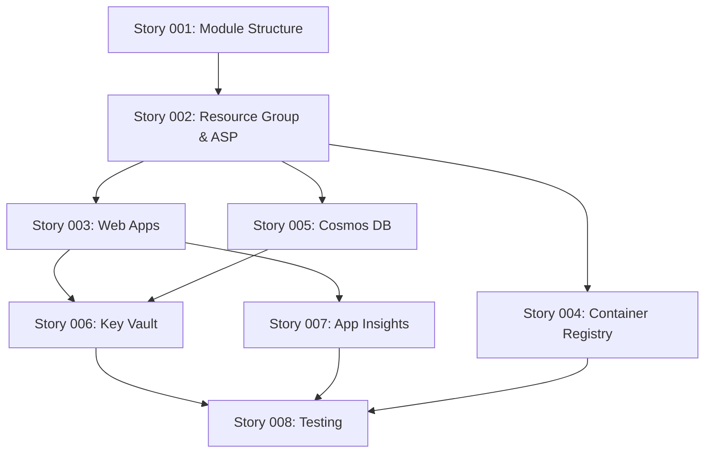

# Sprint 001 Dependency Tracker

## Dependency Management and Coordination

### Critical Path Dependencies

#### Story Dependency Chain

### Internal Dependencies (Within Sprint)

#### D001: Terraform Module Foundation → All Infrastructure Stories
- **Dependency**: Stories 002-008 depend on Story 001 completion
- **Type**: Sequential (blocking)
- **Risk Level**: High
- **Mitigation**: Story 001 prioritized for Day 1-2 completion
- **Owner**: Alex Chen
- **Status**: ⏳ Pending
- **Target Completion**: October 26, 2025

#### D002: Resource Group → Core Services
- **Dependency**: Stories 003, 004, 005 depend on Story 002 Resource Group
- **Type**: Sequential (blocking)
- **Risk Level**: Medium
- **Mitigation**: Story 002 completion by Day 3, parallel development prepared
- **Owner**: Alex Chen
- **Status**: ⏳ Pending
- **Target Completion**: October 28, 2025

#### D003: Web Apps + Cosmos DB → Key Vault Secrets
- **Dependency**: Story 006 requires Story 003 managed identities and Story 005 connection strings
- **Type**: Converging (multiple inputs)
- **Risk Level**: Medium
- **Mitigation**: Coordinate completion timing, prepare Key Vault structure early
- **Owner**: Jordan Martinez
- **Status**: ⏳ Pending
- **Target Completion**: October 31, 2025

#### D004: All Services → Comprehensive Testing
- **Dependency**: Story 008 requires all other stories completed for integration testing
- **Type**: Final validation (blocking)
- **Risk Level**: High
- **Mitigation**: Daily progress tracking, early integration testing where possible
- **Owner**: All Team
- **Status**: ⏳ Pending
- **Target Completion**: November 7, 2025

### External Dependencies

#### ED001: Azure Subscription Access and Permissions
- **Description**: Team requires Contributor access to Azure subscription for resource provisioning
- **Owner**: IT Operations (External)
- **Impact**: Blocks all infrastructure development
- **Status**: ✅ Confirmed
- **Validation Date**: October 25, 2025
- **Contingency**: Escalation path to Director of Engineering identified

#### ED002: Terraform Backend Storage Account
- **Description**: Azure Storage Account required for remote state management
- **Owner**: Platform Infrastructure Team
- **Impact**: Blocks collaborative development and state management
- **Status**: ✅ Configured
- **Validation Date**: October 25, 2025
- **Details**: Storage account `terraformstate001` in subscription, access keys configured

#### ED003: Enterprise Naming and Tagging Standards
- **Description**: Approved naming conventions and tagging policies for Azure resources
- **Owner**: Platform Governance Team
- **Impact**: Could require resource naming changes if standards change
- **Status**: ✅ Documented
- **Validation Date**: October 24, 2025
- **Location**: `.platform-mode/standards/azure-naming-standards.md`

#### ED004: Security Team Infrastructure Review
- **Description**: Security team approval of infrastructure patterns and configurations
- **Owner**: Security Architecture Team
- **Impact**: Could delay Story 006 (Key Vault) and security-related configurations
- **Status**: 🔄 In Progress
- **Scheduled Review**: October 26, 2025, 2:00 PM
- **Contact**: Sarah Johnson (Security Architect)
- **Contingency**: Implement basic security patterns, defer advanced configurations

#### ED005: GitHub Repository Access and Permissions
- **Description**: Team requires write access to infrastructure repository for code commits
- **Owner**: Development Manager
- **Impact**: Blocks code collaboration and version control
- **Status**: ✅ Confirmed
- **Validation Date**: October 25, 2025
- **Repository**: `bookmarks` - platform-engineering branch access confirmed

### Dependency Monitoring

#### Daily Dependency Standup Check
During daily standups, review:
1. **Dependency Status**: Any changes in external dependency status
2. **Blocking Issues**: Dependencies currently blocking progress
3. **Risk Changes**: New dependency risks or mitigation needs
4. **Coordination Needs**: Cross-team coordination required

#### Weekly Dependency Review
Every Wednesday, conduct comprehensive review:
1. **External Dependency Health**: Status of all external dependencies
2. **Internal Dependency Progress**: Story completion impact on dependent work
3. **Risk Assessment**: Updated risk levels for dependency-related issues
4. **Stakeholder Communication**: Updates needed for dependency owners

### Dependency Risk Assessment

| Dependency | Probability of Issue | Impact | Risk Score | Mitigation Priority |
|------------|---------------------|--------|------------|-------------------|
| ED001: Azure Access | Low (10%) | Critical | High | ✅ Already mitigated |
| ED004: Security Review | Medium (30%) | Medium | Medium | 🔄 Active coordination |
| D001: Module Foundation | Low (15%) | Critical | High | 🎯 High priority story |
| D003: Key Vault Timing | Medium (35%) | Medium | Medium | 📅 Schedule coordination |

### Dependency Communication Plan

#### Internal Team Communication
- **Daily Updates**: Dependency status in standup
- **Slack Channel**: #sprint001-dependencies for real-time updates
- **Documentation**: Dependency status updated in this tracker daily

#### External Stakeholder Communication
- **Weekly Status**: Dependency health included in weekly stakeholder reports
- **Issue Escalation**: Immediate notification for blocking dependencies
- **Schedule Impact**: Proactive communication of dependency-related schedule risks

### Dependency Resolution Procedures

#### For Blocking Dependencies
1. **Immediate Assessment**: Evaluate impact on sprint goal
2. **Alternative Path Analysis**: Identify workarounds or alternative approaches
3. **Stakeholder Engagement**: Direct communication with dependency owner
4. **Escalation**: If unresolved within 24 hours, escalate to management
5. **Scope Adjustment**: Consider story scope changes if necessary

#### For At-Risk Dependencies
1. **Proactive Communication**: Reach out to dependency owner for status
2. **Contingency Activation**: Prepare alternative approaches
3. **Schedule Buffer**: Utilize sprint buffer time if needed
4. **Documentation**: Record dependency issues for retrospective learning

### Success Criteria for Dependency Management

#### Sprint Success Indicators
- [ ] **Zero Blocking Dependencies**: No dependencies block story completion
- [ ] **Proactive Resolution**: All dependency issues identified and resolved within 24 hours
- [ ] **Clear Communication**: All stakeholders informed of dependency status
- [ ] **Minimal Scope Impact**: Dependencies do not force story scope reduction

#### Dependency Management Maturity
- [ ] **Predictive Identification**: Dependencies identified before becoming blockers
- [ ] **Stakeholder Relationships**: Strong relationships with external dependency owners
- [ ] **Contingency Readiness**: Workarounds prepared for high-risk dependencies
- [ ] **Process Improvement**: Dependency lessons incorporated into future sprints

### Dependency Handoff to Sprint 002

Dependencies that will carry forward to next sprint:
1. **Infrastructure Foundation**: Sprint 001 infrastructure as foundation for CI/CD pipeline
2. **Security Patterns**: Established security patterns to be replicated in pipeline
3. **Monitoring Integration**: Application Insights foundation for pipeline monitoring
4. **Team Knowledge**: Terraform and Azure expertise developed in Sprint 001

Pre-work for Sprint 002 dependencies:
- [ ] **GitHub Actions Setup**: Service principal creation for CI/CD
- [ ] **Container Images**: Base container images identified for application deployment
- [ ] **Pipeline Permissions**: GitHub repository permissions for Actions workflows
